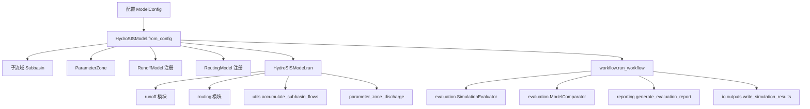
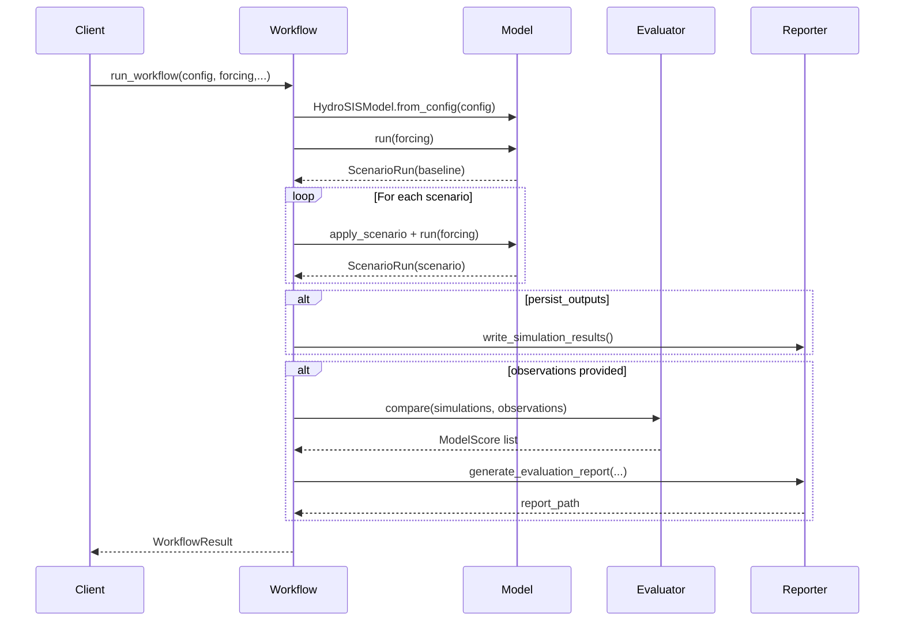

# 第一章 综述与总体架构

> 本章面向首次接触 HydroSIS 的读者，梳理项目的定位、核心目标、关键模块以及运行环境等顶层信息，为后续深入理解原理和实现细节奠定基础。

## 1. HydroSIS 概念与定位

### 1.1 项目愿景

HydroSIS（Hydrological Scenario Intelligence System）旨在提供一个**面向多情景建模、调度分析与评价报告自动化**的分布式水文模拟框架。它在单一仓库内整合了流域划分、产流、汇流、参数分区、情景管理与指标评价等环节，通过结构化配置与高度模块化的代码结构，实现以下目标：

- **快速构建分布式水文模型**：通过 `hydrosis.config.ModelConfig` 将流域划分、参数区、产流与汇流模型组合起来，降低建模门槛。
- **支持情景化分析与假设检验**：`ModelConfig.scenarios` 描述多情景参数修改，可用于流域工程规划或调度对比分析。
- **标准化精度评价与报告输出**：`hydrosis.evaluation` 模块内置 RMSE、MAE、PBIAS、NSE 等指标，可自动生成 Markdown 报告与图表。
- **便于与自然语言接口或大模型集成**：所有建模要素均以 YAML/JSON 配置化描述，便于上层系统（如对话式建模助手）组合调用。

### 1.2 典型用户与应用场景

| 用户角色 | 典型需求 | HydroSIS 提供的能力 |
| --- | --- | --- |
| 水利水文工程师 | 快速评估不同水库调度方案、雨洪预报组合模型 | 基于 `run_workflow` 的多情景运行与指标比较 |
| 科研人员 | 实验多种产流、汇流模型组合，分析参数敏感性 | 插件式模型注册，`parameters.zone` 支持统一参数约束 |
| 数字孪生团队 | 将水文模拟嵌入调度平台，在线生成报告 | Markdown 报告生成、图表导出、结构化输出目录 |
| AI/大模型工程师 | 通过自然语言生成配置并调用模拟服务 | YAML 配置语义清晰，模块接口保持稳定 |

### 1.3 设计理念

HydroSIS 的整体设计理念体现在以下方面：

1. **模块化**：产流、汇流、参数分区、数据 I/O 等模块在代码层面独立实现，通过配置进行组合。如 `hydrosis.runoff.base.RunoffModelConfig` 使用注册表模式将不同产流模型映射到 `model_type` 字段。
2. **可扩展性**：新模型仅需继承抽象基类并注册，即可被 YAML 配置引用，无需修改核心 orchestrator。
3. **透明性**：`hydrosis.model.HydroSISModel` 将子流域结构、参数区和模型实例显式存储，便于调试与二次开发。
4. **可复现性**：`hydrosis.io` 提供标准化的输入输出目录结构，便于记录模拟结果并复现实验。
5. **可集成性**：`hydrosis.workflow.run_workflow` 将模型运行、情景管理、评估与报告整合为一个高层接口，为外部系统提供统一入口。

## 2. 系统总体架构

### 2.1 顶层组件

从仓库 `hydrosis/` 目录来看，项目核心组件可分为七大子系统：

1. **配置解析（`config.py`）**：定义各类配置数据类（模型、I/O、情景、评价计划等），并提供 YAML 解析、字典转换、情景应用等能力。
2. **模型核心（`model.py`）**：封装 `HydroSISModel`，负责串联子流域、参数区、产流与汇流模型，输出局地与累积径流。
3. **流域划分（`delineation/`）**：当前实现 `DEM` 划分配置读取，提供 `DelineationConfig` 及子流域生成逻辑。
4. **产流模块（`runoff/`）**：内置线性水库、SCS 曲线数、XinAnJiang、WETSPA、HYMOD 等概念性模型，通过注册机制统一调度。
5. **汇流模块（`routing/`）**：支持 Muskingum、单纯滞后等算法，同样通过注册表构建实例。
6. **参数分区（`parameters/zone.py`）**：围绕控制点定义参数区，将区域共享的参数投影到多个子流域。
7. **评估与报告（`evaluation/`, `reporting/`）**：包括指标计算、模型对比、Markdown 报告与图表绘制。

下图使用 Mermaid 展示顶层组件及其依赖关系：

### 2.2 运行流程概览

结合 `hydrosis.workflow.run_workflow` 可以概括完整的模拟与评估流程：

1. **模型实例化**：调用 `_instantiate_model` 基于配置创建 `HydroSISModel`，内部包括子流域构建、参数区绑定、产流/汇流模型注册实例化（参见 `HydroSISModel.from_config`）。
2. **基准情景运行**：`_run_model` 调用 `HydroSISModel.run`，先逐子流域复制对应的产流模型并执行 `simulate`，再逐子流域复制汇流模型执行 `route`，最终返回局地径流。随后通过 `accumulate_discharge` 与 `parameter_zone_discharge` 得到汇流结果。
3. **情景循环**：对于 `scenario_ids` 列表中的每个情景，框架复制配置、应用 `ModelConfig.apply_scenario` 将参数修改推送到相关子流域，再次运行模型。
4. **结果持久化**：当 `persist_outputs=True` 时，通过 `hydrosis.io.outputs.write_simulation_results` 将各情景的累积径流写入 CSV。
5. **精度评价**：若提供观测数据，`SimulationEvaluator` 使用配置指定的指标对所有模拟结果与观测进行比较，生成 `ModelScore`。
6. **对比计划执行**：`EvaluationConfig.comparisons` 描述多个对比方案，`_evaluate_plan` 会筛选指定子流域的数据并输出排名。
7. **报告生成**：若启用 `generate_report`，则调用 `reporting.generate_evaluation_report` 输出 Markdown 文档与图表。

该流程提供了从原始配置到报告产出的“全链路”能力，便于集成到批处理任务或大模型驱动的对话式应用中。

### 2.3 分层架构视角

从软件工程角度，HydroSIS 可以拆分为四层：

1. **配置与数据层**：`config.py`、`delineation/`、`parameters/`，负责将外部配置文件转换为内部结构体，为模型提供输入数据。该层与文件系统交互（读取 YAML/JSON、生成目录）。
2. **模型层**：`model.py` 以及 `runoff/`、`routing/` 子模块，实现水文过程模拟的业务逻辑。模型层不直接依赖 I/O，只接受内存数据结构。
3. **服务层**：`workflow.py` 聚合模型层与评估层，定义对外暴露的高层 API。它管理情景迭代、评估、持久化与报告，是最可能被外部系统调用的接口。
4. **呈现与工具层**：`evaluation/` 计算指标、`reporting/` 生成图表与 Markdown，`io/` 负责数据读写，`utils/` 提供拓扑累积等工具。这一层聚焦结果解读与外部系统集成。

这种分层确保：

- 基础模型逻辑与外部依赖解耦，便于测试与扩展。
- 服务层可以灵活组合不同模块，支持定制工作流。
- 呈现层可以演化为 Web/API 服务，而无需修改模型层。

### 2.4 数据流与控制流

#### 数据流

1. **配置输入**：从 `config/example_model.yaml` 等文件读取，加载为 `ModelConfig`。
2. **强迫数据（forcing）**：通常为每个子流域的降雨或产流时序，使用 `hydrosis.io.inputs` 读取，传入 `HydroSISModel.run`。
3. **模拟输出**：局地径流（按子流域）与累积径流（按控制断面），以字典形式保存，并可写入 CSV。
4. **观测数据**：用于评价，与模拟结果在子流域维度对齐。
5. **指标与报告**：最终生成的 Markdown/图表文件，存储于配置指定目录。

#### 控制流

- `run_workflow` 是顶层控制器，依次触发模型实例化、运行、评估、报告。
- 模型运行时，`HydroSISModel.run` 是核心控制单元，负责选择产流/汇流模型并执行。
- 指标计算由 `ModelComparator.compare` 管理，内部调用 `SimulationEvaluator`。

下图示意控制流（简化）：

## 3. 技术栈与外部依赖

### 3.1 编程语言与标准库

HydroSIS 使用 Python 编写，核心依赖标准库（`dataclasses`、`pathlib`、`typing`、`copy`、`itertools` 等），保证在纯 Python 环境即可运行。这一选择使得框架：

- 易于部署到多平台（Windows/Linux/macOS）。
- 能够在缺少高性能 GIS 库的环境中运行（例如轻量容器、云函数）。

### 3.2 可选依赖

- **PyYAML**：`ModelConfig.from_yaml` 解析 YAML 文件时需要。若缺失，可通过 JSON 配置或在示例脚本中自动降级。
- **绘图库（matplotlib）**：`reporting.charts` 绘制指标柱状图、径流过程线时使用。若运行环境不支持图表生成，相关函数会抛出 `RuntimeError` 并被上层捕获，保证主流程不中断。

### 3.3 模块化注册机制

产流与汇流模型依赖于注册表机制：

- `hydrosis.runoff.base.RunoffModelConfig.REGISTRY`、`hydrosis.routing.base.RoutingModelConfig.REGISTRY` 保存 key → class 映射。
- 在各具体实现文件末尾调用 `RunoffModelConfig.register("linear_reservoir", LinearReservoirRunoff)` 等语句完成注册。
- YAML 配置通过 `model_type` 指定注册名，无需硬编码类路径。

这种设计降低了对外部依赖的耦合，便于拓展新算法。

### 3.4 目录与文件依赖

框架对外部文件的依赖主要体现在：

- `config/`：存放模型配置、情景定义。
- `data/`：提供降雨、蒸发、径流观测等输入数据以及示例数据集。
- `results/`：默认输出目录，可在配置中覆盖。

在部署时需要确保这些目录的读写权限，并按约定结构准备数据。

## 4. 部署与运行环境概述

### 4.1 本地开发环境

1. **Python 版本**：建议 3.9 及以上（项目使用类型注解、`pathlib` 等特性）。
2. **依赖安装**：若仅运行核心模型，可直接使用标准库；如需 YAML 支持与绘图，需要额外安装 `pyyaml`、`matplotlib`、`pandas` 等（参照 `requirements.txt` 若存在）。
3. **目录初始化**：确保 `config/`、`data/`、`results/` 等目录存在，并提供配置与示例数据。

### 4.2 生产部署建议

- **容器化**：可以编写 Dockerfile，安装 Python 与必要库，将配置、数据挂载到容器内部。
- **自动化调度**：`examples/run_sample_workflow.py` 展示了命令行入口，可基于此编写 CLI 或调度脚本（如 Airflow、Prefect）。
- **日志与监控**：框架当前使用 print/异常进行反馈，生产环境可在外层包裹日志系统或监控指标。

### 4.3 与大模型/服务集成

- **API 封装**：可以将 `run_workflow` 包装成 REST/RPC 接口，对接上层服务。
- **配置生成**：通过大模型生成 YAML 后写入 `config/`，再调用框架运行，实现“自然语言建模”。
- **结果消费**：`WorkflowResult` 提供了局地与累积径流、评价得分、排名等结构化数据，便于序列化为 JSON 返回调用方。

## 5. 关键术语与约定

| 术语 | 说明 | 相关代码位置 |
| --- | --- | --- |
| Subbasin（子流域） | 分布式模型的基本单元，包括面积、下游指向、参数集合 | `hydrosis.model.Subbasin` |
| Parameter Zone（参数区） | 以控制点为核心的参数共享单元，可包含多个子流域 | `hydrosis.parameters.zone.ParameterZone` |
| Runoff Model（产流模型） | 根据降雨等强迫计算初始径流过程线 | `hydrosis.runoff.*` |
| Routing Model（汇流模型） | 将产流转换为河网下游流量 | `hydrosis.routing.*` |
| Scenario（情景） | 对参数或模型的批量修改，用于假设分析 | `ModelConfig.scenarios` |
| Forcing（强迫数据） | 输入给模型的时间序列，如降雨、蒸发或产流估计 | `hydrosis.io.inputs` |
| Evaluation Metrics | NSE、RMSE、MAE、PBIAS 等评价指标 | `hydrosis.evaluation.metrics` |
| WorkflowResult | 承载基准与情景运行、指标与报告路径 | `hydrosis.workflow.WorkflowResult` |

此外，项目约定：

- 所有时间序列均以列表或 `Sequence[float]` 表示，默认按统一时间步长排列。
- 子流域 ID、参数区 ID、模型 ID 均应在配置中保持唯一。
- 目录路径使用 `pathlib.Path` 管理，保证跨平台兼容性。

## 6. 章节小结

本章从宏观角度梳理了 HydroSIS 的目标、用户、架构与关键术语：

- 项目定位于多情景水文模拟与自动化报告生成，适配工程、科研、AI 等多类用户。
- 框架通过配置化 + 模块化设计实现了产流、汇流、参数区、评估的解耦与复用。
- `run_workflow` 将模型运行、情景管理、评估与报告串联成统一流程，易于集成到外部系统。
- 技术栈以纯 Python 为核心，依赖最小化，便于快速部署；同时通过注册机制支持扩展。
- 本章整理的术语表为阅读后续章节提供了“词汇表”，确保读者对核心概念理解一致。

接下来的章节将分别深入模型原理、代码实现、数据流程、使用说明等内容，帮助读者从理论到实践全面掌握 HydroSIS。
