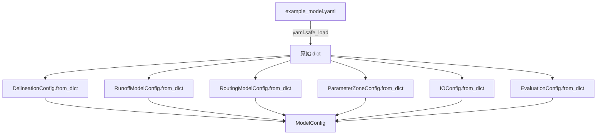
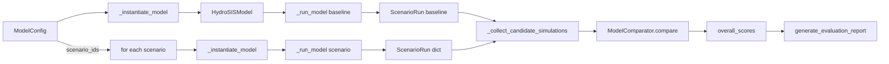

# 第三章 代码结构与实现逻辑

本章聚焦 HydroSIS 仓库的实际代码资产，对目录组织、核心模块、辅助工具链、测试体系以及关键设计模式进行逐层剖析。通过结合源代码、配置示例与高层调用路径，本章旨在帮助读者快速建立对工程实现的整体认知，并掌握定位问题、扩展功能与维护代码的技能。

## 3.1 仓库目录结构详解

HydroSIS 仓库采用模块化的组织方式，将模型逻辑、配置、数据示例与结果输出等资源拆分到语义明确的目录中。下表总结了顶层目录结构及其职责。

| 目录 | 关键内容 | 典型文件 | 说明 |
| --- | --- | --- | --- |
| `Books/` | 技术白皮书与长篇文档 | 《HydroSIS_技术白皮书》提纲.md、第一章、第二章 | 归档项目文档，支持知识沉淀 |
| `config/` | 配置模板 | `example_model.yaml`、`example_model.json` | 提供 YAML/JSON 示例，便于理解 `ModelConfig` 字段 |
| `data/` | 样例输入 | 降雨、蒸散发、观测流量示例 | 便于快速运行示例流程 |
| `examples/` | 教程脚本 | 典型工作流脚本 | 演示如何加载配置并运行模型 |
| `hydrosis/` | 核心 Python 包 | 子模块详见下文 | 承载模型、参数、数据 I/O、评估与报告生成等核心逻辑 |
| `results/` | 默认输出目录 | 自动生成的模拟结果 | `IOConfig` 默认写入此处 |
| `tests/` | 单元与集成测试 | `test_workflow.py` 等 | 确保核心功能的正确性 |

`hydrosis/` 目录是工程的主体，实现按照业务功能划分为多个子包：

```
hydrosis/
├── config.py              # 配置模型与序列化工具
├── delineation/           # 流域划分逻辑（DEM 处理）
├── evaluation/            # 指标计算与方案比较
├── io/                    # 输入输出读写
├── model.py               # HydroSISModel 主类
├── parameters/            # 参数区与控制器定义
├── reporting/             # Markdown 报告与图表
├── routing/               # 径流汇流算法
├── runoff/                # 降雨径流模型族
├── utils/                 # 网络拓扑与公共工具
└── workflow.py            # 高层工作流编排
```

这种分层结构带来两大好处：一是便于替换或扩展子模块（例如新增 `runoff/` 模型），二是让测试可以聚焦在单一职责模块上。

## 3.2 核心模块剖析

### 3.2.1 配置系统（`hydrosis/config.py`）

配置系统以 `dataclass` 为核心，提供类型安全的配置对象，并支持 YAML/JSON 互转。关键类如下：

- `ModelConfig`: 汇总流域划分 (`DelineationConfig`)、产流 (`RunoffModelConfig`)、汇流 (`RoutingModelConfig`)、参数区 (`ParameterZoneConfig`)、I/O 与场景设定。`from_yaml` 负责解析文件，`to_dict` 用于序列化。`apply_scenario` 支持在模拟前注入特定场景的参数改动。 【F:hydrosis/config.py†L19-L164】
- `IOConfig`: 描述降雨、蒸发、观测流量等输入文件以及结果、图像、报告目录。通过路径对象保持可移植性。 【F:hydrosis/config.py†L73-L120】
- `EvaluationConfig`、`ComparisonPlanConfig`: 定义评估指标、对比方案和排序指标，为后续的模型打分和排名提供元数据。 【F:hydrosis/config.py†L19-L72】

配置类之间的协作流程如下图所示：



当调用 `ModelConfig.from_yaml` 时，系统会将 YAML 文件拆分到对应的构造函数，最终生成一个完整的 `ModelConfig`，用于驱动模型构建。

### 3.2.2 模型核心（`hydrosis/model.py`）

`HydroSISModel` 代表主模拟器，负责协调子流域、参数区、产流与汇流模型。构造过程分为四步：

1. 接收 `Subbasin` 列表（由 `DelineationConfig` 生成）与 `ParameterZone` 列表，并将它们映射为字典，以便快速索引。 【F:hydrosis/model.py†L13-L82】
2. `_assign_zone_parameters` 遍历每个参数区，将控制器定义的参数（如 `runoff_model`、`routing_model`）写入对应的子流域。 【F:hydrosis/model.py†L35-L43】
3. `run` 方法逐子流域复制产流模型并调用 `simulate`，生成局部径流；随后根据参数指定的汇流模型调用 `route`，得到下泄过程。 【F:hydrosis/model.py†L45-L77】
4. `accumulate_discharge` 与 `parameter_zone_discharge` 依赖 `utils.accumulate_subbasin_flows` 对网络进行拓扑排序，汇总上下游流量，并输出参数区层级的流量序列。 【F:hydrosis/model.py†L79-L105】

下表总结了 `HydroSISModel.run` 的关键步骤：

| 步骤 | 调用对象 | 输入 | 输出 | 说明 |
| --- | --- | --- | --- | --- |
| 1 | `RunoffModel.simulate` | 子流域参数 + 降雨序列 | 局地径流 | 根据注册模型类型执行具体公式 |
| 2 | `RoutingModel.route` | 子流域 + 局地径流 | 路由后流量 | 允许不同河段采用不同算法 |
| 3 | `_assign_zone_parameters` | 参数区定义 | 子流域参数表 | 支持参数批量控制 |
| 4 | `accumulate_subbasin_flows` | 拓扑结构 + 路由结果 | 各节点含上游的流量 | 拓扑排序避免循环 |

通过深拷贝 (`copy.deepcopy`) 创建模型实例，确保在多场景运行时互不干扰，是 `HydroSISModel` 的一大设计亮点。 【F:hydrosis/model.py†L49-L75】

### 3.2.3 工作流编排（`hydrosis/workflow.py`）

`run_workflow` 是外部使用的主要入口，负责将配置、强迫数据与可选观测数据串联起来，执行基准与情景模拟，并根据需求写入结果、计算评价、生成报告。核心流程如下：



关键函数说明：

- `_instantiate_model`：通过 `HydroSISModel.from_config` 构建模型，封装在局部函数中，便于在基准与情景之间复用。 【F:hydrosis/workflow.py†L41-L47】
- `_run_model`：执行单个场景，返回 `ScenarioRun` 数据类，包含局地流量、累计流量与参数区流量。 【F:hydrosis/workflow.py†L49-L78】
- `_build_evaluator`：根据配置动态选择指标，若未定义则采用默认指标集合。 【F:hydrosis/workflow.py†L80-L115】
- `_evaluate_plan`：按照比较方案筛选模拟结果与参考序列，调用 `ModelComparator` 生成得分与排名。 【F:hydrosis/workflow.py†L139-L211】
- `run_workflow`：综合所有辅助函数，支持持久化输出、批量情景模拟、对比评估以及 Markdown 报告的生成。 【F:hydrosis/workflow.py†L213-L309】

值得注意的是，`run_workflow` 在执行情景模拟时会先深拷贝配置，再调用 `ModelConfig.apply_scenario` 将参数改动注入子流域，有效避免基准场景被污染。 【F:hydrosis/workflow.py†L247-L261】

### 3.2.4 产流与汇流模型族（`hydrosis/runoff`、`hydrosis/routing`）

HydroSIS 借助注册表模式实现可插拔的水文过程模型。`RunoffModelConfig.REGISTRY` 与 `RoutingModelConfig.REGISTRY` 分别维护模型类型到类的映射，任何新模型只需在模块结尾注册即可被配置引用。

- 产流模型示例：
  - `SCSCurveNumber` 基于 SCS 曲线数法，将降雨转换为产流，支持调节曲线数与初始抽吸比。 【F:hydrosis/runoff/scs_curve_number.py†L1-L40】
  - `LinearReservoirRunoff` 等模型则描述不同的水库响应机制，可通过参数控制蓄水与泄流。
- 汇流模型示例：
  - `MuskingumRouting` 实现 Muskingum 方法，通过旅行时间 `k`、权重系数 `x` 和时间步长 `dt` 计算下泄流量。 【F:hydrosis/routing/muskingum.py†L1-L38】
  - `LagRouting` 等模型提供更简单的时滞处理方式。

注册机制示意：

```python
RunoffModelConfig.register("scs_curve_number", SCSCurveNumber)
RoutingModelConfig.register("muskingum", MuskingumRouting)
```

配置文件中只需写 `model_type: scs_curve_number`，工作流即可自动构造对应类实例。

### 3.2.5 评估与报告模块（`hydrosis/evaluation`、`hydrosis/reporting`）

评估模块提供统一的指标计算接口：

- `SimulationEvaluator.evaluate_catchment` 针对每个子流域计算指标（RMSE、MAE、PBIAS、NSE 等），并支持自定义指标集。 【F:hydrosis/evaluation/comparison.py†L29-L83】
- `ModelComparator.compare` 聚合指标并计算加权平均，用于跨模型对比；`rank` 根据指标方向（最大化或最小化）生成排序。 【F:hydrosis/evaluation/comparison.py†L85-L134】

报告模块则关注可视化与 Markdown 输出：

- `reporting.markdown.generate_evaluation_report` 读取模型得分，构建富文本报告并生成图表（折线、散点等），图像保存在 `figures_directory`。
- `reporting.charts` 利用 `matplotlib` 或 `plotly` 绘制对比图，确保评估结果直观呈现。

## 3.3 配置、脚本与工具链

### 3.3.1 配置示例

`config/example_model.yaml` 是理解系统配置的绝佳入口，包含以下几个部分：

1. `delineation`: 定义子流域与网络结构，支持读取 DEM、阈值、出口点等参数。
2. `runoff_models`: 列出可用的产流模型，指定 `id`（供子流域引用）与参数。
3. `routing_models`: 定义汇流算法及其参数，如 Muskingum 或简单滞后模型。
4. `parameter_zones`: 将若干子流域绑定到一个参数控制器，可实现区域化校准。
5. `io`: 指定降雨、蒸发、观测数据的文件路径，以及输出目录。
6. `scenarios`: 可选的情景设定，如修改某些子流域的曲线数以模拟土地利用变化。
7. `evaluation`: 指定评价指标与比较方案，控制 `run_workflow` 的评估逻辑。

### 3.3.2 示例脚本

`examples/` 目录通常包含如下脚本模式：

```python
from pathlib import Path
from hydrosis.config import ModelConfig
from hydrosis.workflow import run_workflow

config = ModelConfig.from_yaml(Path("config/example_model.yaml"))
forcing = load_forcing_series(config.io.precipitation)
observations = load_observed_discharge(config.io.discharge_observations)

result = run_workflow(
    config=config,
    forcing=forcing,
    observations=observations,
    persist_outputs=True,
    generate_report=True,
)
```

通过将配置解析与工作流执行分离，脚本能够灵活地插入数据预处理、参数标定或结果后处理步骤。

### 3.3.3 辅助工具

- `hydrosis/io/inputs.py`: 提供 CSV/NetCDF 等格式的读取函数，统一返回 `{subbasin_id: [series]}` 结构。
- `hydrosis/io/outputs.py`: 将模拟结果写入磁盘，文件命名与目录层级遵循配置，以便后续分析。 【F:hydrosis/workflow.py†L271-L286】
- `hydrosis/utils/network.accumulate_subbasin_flows`: 对拓扑排序和时间序列长度进行严格验证，避免网络循环和数据缺失。 【F:hydrosis/utils/network.py†L1-L91】

## 3.4 测试与持续集成逻辑

虽然仓库当前未展示 CI 配置文件，但 `tests/` 目录覆盖了关键场景：

- `test_workflow.py`: 使用简化数据运行 `run_workflow`，验证情景模拟、指标评价、报告生成等核心路径。
- `test_reporting.py`: 针对 Markdown 报告与图表输出进行快照或结构校验，确保评估结果在文档中正确呈现。
- `test_examples.py`: 检查示例脚本能否正常执行，保证文档中的使用说明与代码保持一致。

测试通常与 `pytest` 配合使用，可通过 `pytest tests/` 运行。测试数据位于 `tests/data/` 或 `data/` 目录，以小规模样例保证运行效率。

## 3.5 关键设计模式与实现细节

1. **注册表模式**：产流与汇流模型通过 `RunoffModelConfig.register` 与 `RoutingModelConfig.register` 维护全局映射。该模式使新模型的接入无需修改核心逻辑，只需在模块内注册即可。 【F:hydrosis/runoff/base.py†L1-L39】
2. **数据类封装**：`ScenarioRun`、`EvaluationOutcome`、`WorkflowResult` 等数据类统一了函数返回结构，便于测试与序列化，且通过类型标注提升可读性。 【F:hydrosis/workflow.py†L17-L39】
3. **拓扑验证**：`accumulate_subbasin_flows` 使用队列执行拓扑排序，并对时间序列长度进行一致性检查，有效防止网络循环与数据缺漏造成的错误传播。 【F:hydrosis/utils/network.py†L1-L91】
4. **延迟导入避免循环依赖**：在 `HydroSISModel.from_config` 内部才导入 `ModelConfig`，避免 Python 在模块初始化时出现循环引用。 【F:hydrosis/model.py†L45-L56】
5. **可选依赖**：`config.py` 对 PyYAML 采用惰性导入并提供友好错误信息，使得在没有安装该依赖的测试环境中也能运行（例如通过 JSON 配置）。 【F:hydrosis/config.py†L7-L18】
6. **深拷贝隔离**：`run_workflow` 在运行每个情景前深拷贝模型配置，确保场景修改不会影响原始对象。这对于批量情景分析和调参实验至关重要。 【F:hydrosis/workflow.py†L247-L261】

## 3.6 总结

本章全面梳理了 HydroSIS 仓库的结构与核心实现。从配置解析、模型构建到工作流执行与结果评估，各模块各司其职并通过数据类和注册表实现低耦合设计。理解这些代码组织方式，有助于开发者在面对实际需求（如新增模型、集成外部数据源或扩展报告格式）时迅速定位修改点，并保证改动具备良好的可维护性。
