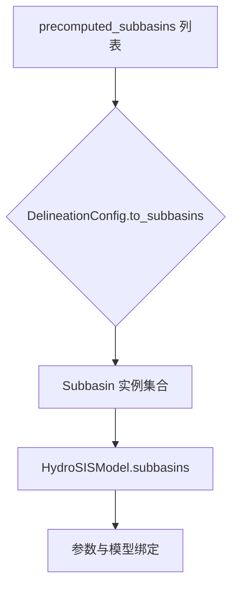

# 第二章 原理与理论基础

> 本章聚焦 HydroSIS 在分布式水文建模中的理论依托与关键算法，阐述数据、参数、模型之间的耦合关系，并结合代码实现分析其核心机制，为后续的流程化操作与扩展开发提供扎实的知识背景。

## 1. 水文信息系统概念回顾

### 1.1 水文循环的建模抽象

水文信息系统的任务是将**自然水循环过程**转换为可计算、可分析的数字模型。为此，需要将降雨-径流转换、地下水补给、河网汇流等复杂过程分解为若干可组合的子模块。HydroSIS 在实现层面采用了“**产流-汇流-评价**”三段式架构：

1. **产流（Runoff）**：以流域或子流域为单元，将降雨、蒸散等外部强迫数据转化为地表与地下径流。模型需要处理土壤水分动态、储量反馈等非线性行为。
2. **汇流（Routing）**：沿着河网将各子流域产流汇集到控制断面，反映洪峰到达时间、波形变化等空间过程。
3. **评价（Evaluation）**：用统计指标对模拟结果与观测数据进行比较，形成定量的精度评估与决策依据。

### 1.2 信息系统视角下的模块化思想

在信息系统理论中，复杂业务往往通过**模块化、抽象化、接口化**来降低耦合度。HydroSIS 的模块设计遵循如下原则：

- **数据与模型解耦**：输入输出路径、观测资料等在 `IOConfig` 中集中管理，与模型结构相分离，便于切换数据源。【F:hydrosis/config.py†L63-L102】
- **算法接口统一**：产流、汇流模型分别继承抽象基类 `RunoffModel`、`RoutingModel`，任何新模型只需实现 `simulate` 或 `route` 方法即可被系统识别。【F:hydrosis/runoff/base.py†L10-L52】【F:hydrosis/routing/base.py†L1-L63】
- **参数区域化管理**：通过 `ParameterZoneBuilder` 将控制断面与上游子流域绑定，确保参数修改具备空间一致性。【F:hydrosis/parameters/zone.py†L38-L88】

### 1.3 数据驱动与知识驱动的融合

HydroSIS 面向的应用既包括依托实测数据进行反演、校准，也包括以经验公式、区域化知识构建的理论模型。系统在配置层提供两类支撑：

- **知识驱动**：配置文件中预定义的模型类型（如 `hymod`、`muskingum`）携带经验参数范围，用户可在缺乏观测数据时快速建立情景模型。【F:hydrosis/runoff/hymod.py†L12-L72】【F:hydrosis/routing/muskingum.py†L1-L37】
- **数据驱动**：评价模块支持 NSE、RMSE、MAE 等指标，为自动化参数校准、情景对比提供量化依据。【F:hydrosis/evaluation/metrics.py†L1-L64】

### 1.4 系统边界与假设

HydroSIS 当前版本在理论层面做出若干约束假设：

- **流域划分需预先提供**：`DelineationConfig.to_subbasins` 要求配置文件中提供 `precomputed_subbasins`，暂未在代码中集成 DEM 自动处理流程。【F:hydrosis/delineation/dem_delineator.py†L28-L51】
- **时间步长统一**：所有子流域的强迫数据和模拟序列长度必须一致，`accumulate_subbasin_flows` 在运行时会对长度差异抛出错误。【F:hydrosis/utils/network.py†L10-L74】
- **线性水动力近似**：默认汇流模型采用线性 Muskingum 方法，适合中小流域的时段模拟；若需考虑潮汐、非线性惯性效应，需要开发扩展模型。

这些假设界定了系统的适用场景，也为二次开发提供了明确的改进方向。

## 2. HydroSIS 核心算法与模型

### 2.1 流域划分与网络拓扑

`DelineationConfig` 是连接实测地理信息与模型内部结构的桥梁。当前实现重点在于**从结构化配置重建子流域网络**：

配置项中的 `downstream` 字段在 `ParameterZoneBuilder` 与 `accumulate_subbasin_flows` 中被反复利用，用于构建拓扑和执行拓扑排序。拓扑排序保证了在汇流累积时，上游结果始终先于下游合成，从而避免循环依赖。【F:hydrosis/parameters/zone.py†L51-L88】【F:hydrosis/utils/network.py†L30-L74】

### 2.2 参数分区与控制点理论

HydroSIS 的参数管理遵循“**控制点-上游域-参数模板**”三元组：

1. **控制点**：通常是水文站、断面或闸坝，对应配置 `control_points`。
2. **上游域**：通过 `_collect_upstream` 递归检索所有上游子流域，形成参数覆盖范围。【F:hydrosis/parameters/zone.py†L70-L88】
3. **参数模板**：以字典形式存储，既可以是产流模型选择（`runoff_model`），也可以是具体参数值。

这种机制的理论基础是**子流域参数区域化**，它强调在同一水文响应单元内共享一组参数，既确保空间一致性，也降低了校准维度。

### 2.3 产流模型族

HydroSIS 目前提供多种产流模型，代码通过注册表机制维护：

| 模型 | 描述 | 主要参数 | 适用场景 |
| --- | --- | --- | --- |
| `hymod` | 五水库结构，快流与慢流并行 | `max_storage`、`beta`、`quick_k` 等 | 对非线性产流、土壤水分敏感的流域 |
| `linear_reservoir` | 线性蓄水池，响应时间短 | `coefficient`、`initial_storage` | 小流域、响应线性假设 |
| `xinanjiang` | 新安江三水库模型 | 土壤张力水容量、产流分配系数 | 湿润区山地流域 |
| `wetspa` | 水文生态过程模拟 | 融雪、蒸散参数 | 融雪显著或生态过程敏感区域 |

以 HYMOD 为例，其核心算法包括：

- **非线性土壤水库**： `_effective_rain` 使用储量上限 `smax` 与指数参数 `beta` 控制入渗过程。【F:hydrosis/runoff/hymod.py†L21-L43】
- **串联快流库**： `_route_quickflow` 将快流在多级水库中依次递推，体现雨洪波形的扩散与衰减。【F:hydrosis/runoff/hymod.py†L45-L58】
- **快慢流并联合成**：在 `simulate` 中以 `quickflow_ratio` 分配有效雨量，慢流采用单一水库指数衰减，最后按子流域面积换算为流量。【F:hydrosis/runoff/hymod.py†L60-L72】

注册表模式通过 `RunoffModelConfig.register` 绑定字符串标识与具体类，配置文件使用 `model_type` 指定模型，确保灵活扩展。【F:hydrosis/runoff/base.py†L25-L52】

### 2.4 汇流模型族

汇流模块以 `RoutingModel` 抽象类为核心，其 `route` 接口输入本地产流序列，输出下游边界的流量。默认实现包括：

- **Muskingum 法**：使用经典的 `(k, x, Δt)` 参数，将河段视为储量-流量关系的线性系统，递推系数 `c0`、`c1`、`c2` 反映入流、前期入流与前期出流的权重。【F:hydrosis/routing/muskingum.py†L12-L31】
- **滞时模型（lag）**：通过固定的时间偏移模拟洪峰迟滞。

当模型运行时，`HydroSISModel.run` 为每个子流域按参数指定的 `routing_model` 实例化并执行，保证同一模型可以在不同子流域使用不同参数组合。【F:hydrosis/model.py†L34-L77】

### 2.5 时序汇流与全流域累积

产流与汇流的耦合完成后，系统还需计算控制断面的总流量。这一步在 `accumulate_subbasin_flows` 完成：

1. **拓扑排序**：以入度为零的子流域（最上游）为起点，逐步向下游推进，确保在合并时上下游顺序正确。
2. **序列对齐**：函数首先校验所有序列长度相同，避免数据对齐错误。【F:hydrosis/utils/network.py†L10-L30】
3. **逐时段累加**：对每个时间步进行循环，将上游出流累加到下游对应时刻，直至所有子流域处理完毕。【F:hydrosis/utils/network.py†L42-L73】

最终结果可用于水文站点对比、调度计算或参数区域的总流量分析，`HydroSISModel.parameter_zone_discharge` 进一步将控制点与参数区关联，用于场景化评价。【F:hydrosis/model.py†L79-L101】

## 3. 数据处理与预处理流程

### 3.1 输入数据结构

`IOConfig` 定义了系统必需的数据来源：

- `precipitation`：降雨强迫序列，支持 CSV、NetCDF 等结构化文件。
- `evaporation`：可选蒸散序列，当模型需要考虑蒸散作用时提供。
- `discharge_observations`：对比用实测流量数据。
- `results_directory`、`figures_directory`、`reports_directory`：输出目录结构，方便组织批量实验结果。【F:hydrosis/config.py†L63-L102】

在理论上，HydroSIS 将时间序列视为固定步长的离散样本，因此要求所有输入数据具备**统一的时间分辨率与长度**。这保证了模型运行和指标评估的可比性。

### 3.2 子流域参数初始化

当 `ModelConfig.from_yaml` 构造模型时，流程如下：

1. 读取划分结果，生成 `Subbasin` 列表。
2. 通过 `ParameterZoneBuilder.from_config` 根据控制点自动扩展到上游子流域，并生成参数字典。
3. 为每个子流域实例化产流、汇流模型，将模型引用存储在 `HydroSISModel` 中。
4. 调用 `_assign_zone_parameters`，将参数模板写入对应子流域的 `parameters` 字段，形成运行时所需的模型选择与参数值。【F:hydrosis/model.py†L20-L52】

### 3.3 情景化参数修改

`ScenarioConfig` 允许针对特定子流域修改参数（例如调整某水库的调度系数）：

- 配置中以 `scenario_id -> {subbasin_id: {parameter: value}}` 形式声明。
- 运行前通过 `ModelConfig.apply_scenario` 将修改写入子流域，形成新的模型组合。【F:hydrosis/config.py†L130-L165】

这一机制在理论上对应“**情景分析**”方法：在保持系统结构不变的情况下，改变边界条件或参数以评估不同策略的影响。

### 3.4 评价指标计算

HydroSIS 的评价指标体系遵循国际通行的水文模型精度评价标准：

- **RMSE**：衡量模拟与观测的平均误差幅度，对峰值偏差敏感。【F:hydrosis/evaluation/metrics.py†L13-L24】
- **MAE**：平均绝对误差，对异常值鲁棒性高。【F:hydrosis/evaluation/metrics.py†L26-L33】
- **PBIAS**：模拟总量相对于观测的偏差百分比，便于判断系统性高估或低估。【F:hydrosis/evaluation/metrics.py†L35-L49】
- **NSE**：Nash-Sutcliffe 效率，衡量模拟曲线对观测曲线的拟合程度，取值范围 (-∞, 1]。【F:hydrosis/evaluation/metrics.py†L51-L64】

这些指标共同构建了模型校准、情景评估的定量基础。

### 3.5 报告与可视化（理论）

虽然仓库中未直接给出图表生成代码，但从目录结构和配置选项可以推断，报告生成模块 (`hydrosis.reporting`) 会利用评价结果和时序数据生成 Markdown 或图像文件。理论上，这些报告应包含：

- 指标对比表格：展示各模型、各情景的评价分数。
- 流量过程线图：比较模拟与观测时间序列。
- 参数敏感性分析：结合场景化修改展示参数变化对结果的影响。

这些内容有助于决策者快速理解模型表现和风险点。

## 4. 系统扩展性的理论支撑

### 4.1 抽象基类与工厂模式

产流与汇流模块通过注册表实现工厂模式，使得添加新模型的理论成本降到最低：

1. 新建模型类并继承 `RunoffModel` 或 `RoutingModel`。
2. 在模块底部调用 `RunoffModelConfig.register("identifier", ModelClass)`。
3. 配置文件中即可使用 `model_type: identifier` 调用新模型。

这种设计体现了**开闭原则**：对扩展开放、对修改关闭。系统无需修改现有核心代码即可加载新的水文算法。【F:hydrosis/runoff/base.py†L25-L52】

### 4.2 参数区域化与层次控制

`ParameterZoneBuilder` 使用集合运算和 DFS 遍历确保参数区域之间互斥，从理论上防止“参数重叠”导致的重复赋值问题。这对应于分布式模型中的“**层次参数控制**”思想：上游参数覆盖范围由控制点决定，下游控制点可在不影响上游的前提下拥有独立的参数集合。【F:hydrosis/parameters/zone.py†L51-L88】

### 4.3 网络算法保障可扩展

`accumulate_subbasin_flows` 采用广度优先的拓扑排序与逐时间步累加方式，时间复杂度约为 O(N·T)，其中 N 为子流域数、T 为时间步数。该算法在理论上支持上百子流域的模拟，只需确保拓扑无环即可。【F:hydrosis/utils/network.py†L30-L74】

### 4.4 配置驱动的实验管理

通过 `ComparisonPlanConfig`、`EvaluationConfig` 等结构，HydroSIS 能够将多模型、多情景的实验设计抽象为配置：

- 一个 `ComparisonPlanConfig` 可指定多个候选模型、参考数据、排名指标。【F:hydrosis/config.py†L18-L51】
- 多个比较方案组合成 `EvaluationConfig`，实现批量评估与报告生成。

这种配置驱动模式便于与调度系统、自动化校准框架集成，为大规模实验提供理论支撑。

### 4.5 错误处理与鲁棒性

HydroSIS 在关键节点设置了显式的错误检查：

- 缺少模型注册会在 `RunoffModelConfig.build` 时报错，提醒用户注册新模型或修正配置。【F:hydrosis/runoff/base.py†L45-L52】
- 子流域若未指定 `runoff_model` 或 `routing_model`，`HydroSISModel.run` 会抛出异常，防止静默失败。【F:hydrosis/model.py†L53-L77】
- 汇流拓扑若存在循环或缺失，将在累积阶段触发错误提示。【F:hydrosis/utils/network.py†L30-L74】

这些机制在理论上确保了系统运行的可诊断性，便于在二次开发时快速定位问题。

## 5. 小结

本章从水文信息系统的概念出发，梳理了 HydroSIS 在流域划分、参数管理、产流与汇流模型、数据处理、评价指标等方面的理论基础，并结合源码解析其关键算法实现。理解这些原理，有助于在后续章节中更高效地部署系统、执行典型案例和开展二次开发。
