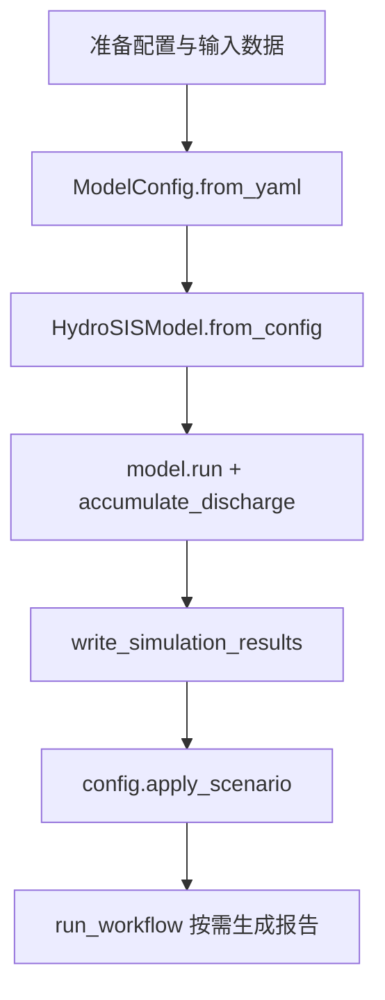

# 第五章 使用指南

本章面向首次接触 HydroSIS 的工程师、科研人员与运维人员，系统梳理环境准备、运行方式、配置编写、结果验证以及常见问题排查方法。结合仓库提供的示例工程与核心模块源码，帮助读者在不运行复杂脚本的情况下准确理解框架的操作手册与自定义空间。

## 5.1 环境准备

### 5.1.1 运行时依赖概览

HydroSIS 基于纯 Python 实现，核心模块仅依赖标准库；在加载 YAML 配置时可选使用 `PyYAML`，若缺失则会显式抛出 ImportError，提醒用户改用 JSON 配置或安装该依赖。【F:hydrosis/config.py†L8-L152】示例工作流脚本也内建了 JSON 回退逻辑，保证在无第三方依赖的环境下仍可执行完整流程。【F:examples/run_sample_workflow.py†L35-L75】

在部署环境时建议遵循以下步骤：

1. 创建独立的 Python 虚拟环境并激活，以隔离潜在依赖冲突；
2. 可选安装 `PyYAML` 以便直接读取 YAML 配置；
3. 准备 `config/`、`data/` 目录的示例资源以验证安装是否成功。

### 5.1.2 目录与资源清单

仓库 README 给出了最小运行所需目录结构，覆盖模型源码、配置示例与数据资源，便于用户快速定位各类文件。【F:README.md†L15-L48】为确保流程顺利，部署前请确认以下要素已就绪：

| 类别 | 路径/文件 | 作用 |
| --- | --- | --- |
| 核心模型 | `hydrosis/` | 产流、汇流、评价、报告等全部实现 | 
| 示例配置 | `config/example_model.yaml` / `config/example_model.json` | 讲解参数含义并可直接运行 | 
| 示例数据 | `data/sample/forcing`、`data/sample/observations` | 构造降雨与观测序列验证模型 | 
| 输出目录 | `results/` | 保存基准与情景结果、报告与图表 | 

## 5.2 基本命令与运行流程

### 5.2.1 快速上手步骤

README 中给出了四步式的快速上手流程，覆盖配置准备、模型实例化、情景应用与评价报告生成，是新用户了解框架的首选参考。【F:README.md†L32-L106】按照文档指引依次执行可获得完整的基准模拟与情景对比结果。流程要点如下：

### 5.2.2 常用脚本与命令

示例工作流脚本 `examples/run_sample_workflow.py` 封装了运行示例工程的完整命令行入口，通过执行 `python examples/run_sample_workflow.py` 即可完成模型加载、情景运算、结果持久化与报告生成。【F:README.md†L81-L105】【F:examples/run_sample_workflow.py†L137-L180】执行过程中脚本会自动：

- 解析示例配置并在缺少 YAML 依赖时回退到 JSON；【F:examples/run_sample_workflow.py†L35-L75】
- 解析降雨驱动、生成或读取观测序列；【F:examples/run_sample_workflow.py†L78-L123】
- 调用 `run_workflow` 运行基准与情景并选择性持久化结果、绘制报告；【F:examples/run_sample_workflow.py†L151-L178】【F:hydrosis/workflow.py†L168-L267】
- 在控制台输出首批流量值与评价指标，帮助快速核对结果。【F:examples/run_sample_workflow.py†L164-L179】

下表汇总了常用命令与触发的框架组件，便于制作脚本或集成到 CI：

| 操作 | 示例命令 | 关键调用 | 说明 |
| --- | --- | --- | --- |
| 运行示例工作流 | `python examples/run_sample_workflow.py` | `run_workflow` | 生成基准/情景结果、报告与日志 | 
| 手动加载配置并运行 | 见 README 第 2 步代码片段 | `HydroSISModel.run`、`accumulate_discharge` | 适合在 Jupyter/脚本中嵌入 | 
| 写出模拟结果 | 片段中的 `write_simulation_results` | `hydrosis/io/outputs.py` | 将每个子流域的时序写入 CSV | 

### 5.2.3 输出目录结构

`write_simulation_results` 会自动创建输出目录并为每个子流域写出 CSV，文件首列记录索引、末列记录流量；同模块还提供了 Markdown 写入工具以保存自动报告。【F:hydrosis/io/outputs.py†L10-L30】默认结果目录取自配置文件，可在 `ModelConfig.io` 中重定向至任意路径。【F:hydrosis/config.py†L79-L171】

## 5.3 配置参数说明

### 5.3.1 模型构件

示例配置涵盖了流域划分、产流模型、汇流模型与参数区设置等核心部分，适合作为自定义工程的模板。【F:config/example_model.yaml†L3-L103】关键字段解释如下：

- **`delineation`**：指定 DEM、汇水点、预计算子流域及其对应的产流、汇流模型标识；
- **`runoff_models` / `routing_models`**：列出可供选择的算法及其参数，例如曲线数法、XinAnJiang、Muskingum；
- **`parameter_zones`**：定义控制点与默认参数映射，框架会在模型实例化时按控制区覆盖子流域。【F:hydrosis/model.py†L32-L51】

### 5.3.2 情景与 I/O 配置

- **`scenarios`**：通过子流域 ID 对应的参数字典描述“假设情景”，运行时 `apply_scenario` 会遍历情景定义并更新相应子流域参数。【F:config/example_model.yaml†L111-L131】【F:hydrosis/config.py†L185-L192】
- **`io`**：统一描述降雨、观测、结果、图表、报告目录，均支持相对路径；缺省字段会在运行时按约定回落到默认路径。【F:config/example_model.yaml†L104-L110】【F:hydrosis/config.py†L79-L171】
- **`evaluation`**：配置指标列表、比较方案与排序指标，`run_workflow` 会据此对指定子流域、情景组合执行排名。【F:config/example_model.yaml†L123-L131】【F:hydrosis/workflow.py†L223-L259】

下表展示了常见配置段落与生效阶段的对应关系：

| 配置段落 | 生效入口 | 用途 |
| --- | --- | --- |
| `delineation` | `HydroSISModel.from_config` | 构建子流域与控制区网络 | 
| `runoff_models` / `routing_models` | `HydroSISModel.from_config` | 注册可选的产流、汇流算法 | 
| `parameter_zones` | `HydroSISModel.__init__` | 初始化控制点默认参数并覆盖子流域 | 
| `scenarios` | `ModelConfig.apply_scenario` | 在运行情景时注入参数修改 | 
| `io` | `run_workflow` / I/O 工具 | 决定数据读取与持久化路径 | 
| `evaluation` | `run_workflow` | 控制指标计算、排名与报告生成 |

## 5.4 结果验证与质量控制

### 5.4.1 自动化评价

`run_workflow` 会根据 `EvaluationConfig` 构建 `SimulationEvaluator` 与 `ModelComparator`，在存在观测数据时自动计算各项指标并汇总排名，必要时生成 Markdown 报告与配套图表。【F:hydrosis/workflow.py†L223-L259】【F:hydrosis/evaluation/comparison.py†L14-L128】【F:hydrosis/reporting/__init__.py†L3-L15】报告最终会写入 `reports_directory` 下，便于归档与共享。【F:hydrosis/workflow.py†L240-L259】

### 5.4.2 手动抽样核查

示例脚本在运行完工作流后，会打印各子流域的前若干个累计径流值，以及总体指标结果，帮助用户快速审查输出是否与预期一致。【F:examples/run_sample_workflow.py†L164-L175】若需要更深入的比对，可直接读取 `results/` 目录下的 CSV 文件，或调用 `ModelComparator.rank` 查看不同情景的指标排序。【F:hydrosis/io/outputs.py†L10-L23】【F:hydrosis/evaluation/comparison.py†L92-L109】

### 5.4.3 数据与配置一致性检查

若配置中引用的子流域在情景或参数区中缺失，会在运行时触发 `KeyError` 或 `ValueError`，提醒用户修正配置。例如：

- 情景 ID 不存在时，`apply_scenario` 会抛出 `KeyError`。【F:hydrosis/config.py†L185-L188】
- 子流域未绑定产流或汇流模型时，`HydroSISModel.run` 会抛出 `ValueError`，提示参数缺失。【F:hydrosis/model.py†L70-L91】

通过提前验证配置文件并保持子流域 ID 一致，可有效避免运行时错误。

## 5.5 常见问题排查

1. **缺少 PyYAML**：当环境未安装 PyYAML 时，直接调用 `ModelConfig.from_yaml` 会报错；此时可先安装依赖，或参考示例脚本改用 JSON 配置加载流程。【F:hydrosis/config.py†L124-L152】【F:examples/run_sample_workflow.py†L35-L75】
2. **观测数据缺失**：示例脚本提供了 `_ensure_observations`，会在缺少观测 CSV 时基于基准情景生成扰动序列并写入磁盘，可作为测试或教学场景的应急方案。【F:examples/run_sample_workflow.py†L78-L123】
3. **输出未写入**：确认配置中的 `results_directory` 指向有效路径，`write_simulation_results` 会负责创建目录并写入子流域 CSV；若路径不可写入请检查权限或磁盘空间。【F:config/example_model.yaml†L104-L108】【F:hydrosis/io/outputs.py†L18-L22】
4. **指标排序异常**：检查 `evaluation.comparisons` 中 `ranking_metric` 是否与指标列表匹配；`ModelComparator.rank` 会依据指标的“最大化/最小化”取向排序，指标缺失时会回退为无穷大导致排序靠后。【F:config/example_model.yaml†L123-L131】【F:hydrosis/evaluation/comparison.py†L92-L109】

---

通过以上指南，读者可以从零开始搭建 HydroSIS 的最小示例环境，理解配置与运行流程，并掌握结果核查及异常排查方法，为后续案例分析与二次开发打下扎实基础。
