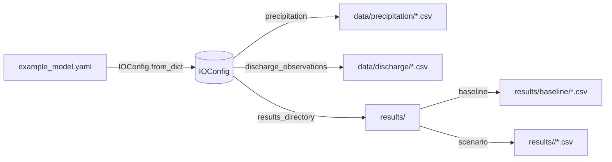

# 第四章 数据管理与计算流程

本章聚焦 HydroSIS 在数据层面的工程实践，串联从原始要素采集、统一配置描述、计算任务调度到结果落地与评估反馈的完整链路。内容覆盖数据源类型、文件组织方式、I/O 工具的实现、模型运行时的内存结构、批量模拟流程以及性能与质量保障策略，帮助读者理解如何在真实项目中构建稳健的数据通道。

## 4.1 数据源与数据格式

HydroSIS 的数据管线以 `ModelConfig` 中的 I/O 配置为中心，统一描述降雨、蒸散发、观测流量等输入路径，以及结果、图表、报告等输出目录。`IOConfig` 以 `dataclass` 形式定义字段并提供 `from_dict` 工厂函数，支持从 YAML/JSON 配置中解析路径，同时容忍可选资源（例如无蒸发量时设为 `None`）。【F:hydrosis/config.py†L79-L152】

| 数据类别 | 配置字段 | 默认/可选 | 说明 |
| --- | --- | --- | --- |
| 降雨/产流驱动 | `precipitation` | 必选 | CSV 目录，文件名对应子流域 ID，列格式详见示例数据 |
| 潜在蒸散发 | `evaporation` | 可选 | 当模型需要蒸散发驱动时提供，否则为 `null` |
| 观测流量 | `discharge_observations` | 可选 | 供精度评估使用的实测序列 |
| 结果目录 | `results_directory` | 默认 `results/` | 批量模拟输出的根目录 |
| 图形目录 | `figures_directory` | 可选 | 评估报告绘图的存储位置，不提供时回落到 `results/figures` |
| 报告目录 | `reports_directory` | 可选 | Markdown 报告目录，不提供时回落到 `results/reports` |

仓库中的 `data/` 目录提供了对应的示例 CSV 文件，开发者可以仿照结构准备项目数据。在实践中，建议为每个子流域的降雨与蒸散发使用统一的时间粒度（如小时或日尺度），并以第一列记录时间索引或整数步长，最后一列记录数值，以兼容默认的 CSV 解析逻辑。

下图总结了配置文件、磁盘数据与运行时对象之间的映射关系：

在准备外部数据时，建议按照以下规范：

1. **文件命名即子流域 ID**：`load_forcing` 会遍历降雨目录下的 `*.csv` 文件并以文件名（去扩展名）作为键，以便在计算阶段直接匹配模型中的子流域编号。【F:hydrosis/io/inputs.py†L24-L28】
2. **列顺序灵活、取最后一列**：`load_time_series` 读取 CSV 时只提取最后一列并尝试转为浮点数，这意味着前置列可以保存时间戳或其他元数据，同时兼顾数据清洗的鲁棒性（遇到非数值或空行会跳过）。【F:hydrosis/io/inputs.py†L10-L21】
3. **统一的编码与换行**：默认使用 UTF-8 与 `\n` 换行，便于跨平台共享；如需其他编码，建议在写入前转换，避免运行时解析失败。

## 4.2 数据清洗、转换与存储策略

### 4.2.1 输入加载流程

HydroSIS 通过 `hydrosis.io.inputs` 模块提供轻量级的读取工具。`load_time_series` 负责逐行解析 CSV，将最后一列转换为浮点数组；`load_forcing` 接收一个目录，批量汇总所有文件形成 `{subbasin_id: [values...]}` 的映射，并作为 `HydroSISModel.run` 的强制输入。该设计将数据清洗责任前置到文件层，使运行时逻辑保持简单可控。【F:hydrosis/io/inputs.py†L10-L28】

在数据进入模型前，常见的清洗动作包括：

- 使用脚本或 ETL 工具补齐缺失行（例如通过线性插值或以 `NaN` 标记并在模型层处理）。
- 对观测流量进行异常检测，剔除物理不合理的尖峰值。
- 按照配置中的子流域列表筛选并重命名文件，确保路径与模型拓扑一致。

### 4.2.2 输出持久化

`hydrosis.io.outputs` 模块同样采用 CSV 作为默认输出格式。`write_time_series` 保证目录存在后逐行写出索引与数值；`write_simulation_results` 则以子流域 ID 为文件名批量落盘，便于后续分析或可视化；`write_markdown` 则用于保存评估报告等 Markdown 文档。【F:hydrosis/io/outputs.py†L10-L30】

该实现具备以下特点：

- **幂等性**：重复运行会覆盖旧文件，确保目录状态与最新模拟保持一致。
- **结构化输出**：以目录划分基线与情景结果，文件命名与输入保持一致，便于对比。
- **可扩展性**：如需写入 NetCDF、Parquet 等格式，可在相同模块下新增函数并在工作流中替换调用。

### 4.2.3 数据生命周期管理

从输入到输出的生命周期可概括为：

1. **配置阶段**：通过 `ModelConfig.from_yaml` 解析配置，构建 `IOConfig` 和其他模型组件，为后续操作准备路径与场景信息。【F:hydrosis/config.py†L124-L152】
2. **运行阶段**：`run_workflow` 调用 `_run_model` 执行基线与情景模拟，生成内存中的局部流量、汇总流量以及参数区流量。【F:hydrosis/workflow.py†L54-L213】
3. **持久化阶段**：若启用 `persist_outputs`，则调用 `write_simulation_results` 将数据落盘，并在需要时生成 Markdown 报告或图形资源。【F:hydrosis/workflow.py†L215-L259】【F:hydrosis/io/outputs.py†L18-L30】
4. **评估阶段**：利用观测数据和比较方案计算指标，支持自动报告和决策反馈，详见第六章。

开发者可在该流程的任意节点插入自定义处理，例如在 `_run_model` 后立即对 `ScenarioRun.local` 做平滑处理，或在写入前将结果转为区域统计指标。

## 4.3 数据建模与参数化流程

### 4.3.1 配置驱动的参数映射

`ModelConfig` 集成了流域划分、产流/汇流模型、参数区与 I/O 路径等信息，构成模型运行的单一真实来源。`apply_scenario` 根据场景 ID 定位到对应的参数修改表，并遍历所有子流域，将增量参数写入实例化的 `Subbasin` 对象，实现数据驱动的参数替换。【F:hydrosis/config.py†L112-L192】

这种配置化策略带来的好处包括：

- **显式可追溯**：所有数据依赖与参数修改均写入 YAML，便于审计与版本控制。
- **批量场景管理**：无需手动复制配置文件，通过 `scenario_ids` 即可选择性运行部分情景。【F:hydrosis/workflow.py†L200-L213】
- **与输入目录解耦**：场景配置只关注参数修改，强迫将数据预处理与模型参数分离，减少隐式耦合。

### 4.3.2 内存数据结构

在模拟执行过程中，`_run_model` 构造的 `ScenarioRun` 包含三类关键数据：

1. `local`：每个子流域的原始产流序列。
2. `aggregated`：经过网络拓扑累积后的下泄流量。
3. `zone_discharge`：按照参数区聚合的流量字典，用于面向管理单元的分析。【F:hydrosis/workflow.py†L54-L72】

这些结构均以 `dict[str, list[float]]` 表示，既能保持 Python 原生的易用性，也便于直接序列化成 CSV。开发者可在自定义分析中直接使用这些字段，或转换为 `pandas.DataFrame` 进行进一步处理。

### 4.3.3 模型评估数据

当提供观测流量时，`run_workflow` 会构造一个 `ModelComparator` 对象，通过 `_collect_candidate_simulations` 汇总基线与各场景的模拟结果，并调用 `_build_evaluator` 选取配置中声明的指标（如 RMSE、NSE 等）进行评分。【F:hydrosis/workflow.py†L75-L259】

评估阶段的数据依赖包括：

- `observations`：来自 `IOConfig.discharge_observations` 的实测序列。
- `comparisons`：`EvaluationConfig` 中定义的对比方案，指定参与模型、参照序列和目标子流域集合。【F:hydrosis/config.py†L53-L76】
- `metrics`：指标函数集合，可按需扩展或替换。【F:hydrosis/workflow.py†L75-L88】

## 4.4 计算流程与任务调度

### 4.4.1 基线-情景流水线

`run_workflow` 将整个计算流程抽象为“基线 + 多情景”的流水线：

1. **实例化模型**：通过 `_instantiate_model` 基于配置创建 `HydroSISModel`，确保每次运行的模型状态独立。【F:hydrosis/workflow.py†L48-L73】
2. **执行基线**：调用 `_run_model` 获取基线 `ScenarioRun`，形成后续比较的参照物。
3. **迭代场景**：根据 `scenario_ids` 或配置中的默认列表，深拷贝配置并应用场景修改，确保不同情景之间的数据隔离。【F:hydrosis/workflow.py†L200-L213】
4. **结果落盘与报告**：在启用 `persist_outputs` 或 `generate_report` 时，将上述结果写入磁盘并生成 Markdown 报告。【F:hydrosis/workflow.py†L215-L259】

该设计的关键在于对配置的深拷贝以及场景参数的晚绑定，从而避免多场景间的状态污染。

### 4.4.2 任务编排建议

在生产环境中，可结合以下策略提升计算效率与可靠性：

- **批量调度**：利用任务队列（如 Celery、Airflow）或 HPC 作业系统，将不同流域或情景划分为独立任务，充分利用并行计算资源。
- **数据缓存**：对于不随情景变化的输入，可缓存 `forcing` 数据结构（如序列化为 `.pkl` 或写入共享内存）以减少重复读取成本。
- **增量更新**：当仅新增少量情景时，可通过 `scenario_ids` 参数指定运行范围，避免重新计算全部组合。【F:hydrosis/workflow.py†L200-L213】
- **自动化报告**：结合 `generate_report=True` 自动生成质量报告，为项目管理者提供透明的结果摘要与图表。

### 4.4.3 错误处理与质量控制

虽然核心代码保持简洁，仍建议在外层调用时加上日志与异常捕获，以便：

- 记录每次运行的配置哈希与输入文件校验和，实现可追溯的审计链路。
- 在 `load_forcing` 出现数据缺失时抛出自定义异常，提示用户检查目录结构。
- 对 `write_simulation_results` 的输出进行校验（例如读取部分 CSV 检查长度一致性），确保数据完整。

## 4.5 性能优化与资源管理

### 4.5.1 I/O 性能考虑

尽管当前实现针对中小规模流域已足够高效，但在大规模模拟中仍需关注以下优化方向：

- **批量读写**：`load_forcing` 与 `write_simulation_results` 分别遍历目录、逐文件处理。可通过并行 I/O 或异步任务加速，尤其在 SSD 或分布式文件系统上。【F:hydrosis/io/inputs.py†L24-L28】【F:hydrosis/io/outputs.py†L18-L22】
- **列式存储**：针对长时间序列，可考虑扩展支持 Parquet 或 Zarr 等列式/块存储格式，减少磁盘占用与提升检索性能。
- **数据压缩**：在结果目录中启用 Gzip/ZIP，或使用 `pandas` 写入压缩 CSV，以平衡磁盘与读取成本。

### 4.5.2 内存与计算负载

- **懒加载**：对于观测流量等大型数据，可在需要评估时再加载，或按子流域分块读取，以降低峰值内存占用。
- **向量化计算**：当前的产流与汇流逻辑以 Python 循环为主，若性能成为瓶颈，可在模型层引入 NumPy 或 Numba 加速，并确保 `ScenarioRun` 的接口保持兼容。
- **缓存评估指标**：当多次运行相同情景、仅修改指标集时，可缓存 `_collect_candidate_simulations` 的结果，避免重复汇总。【F:hydrosis/workflow.py†L100-L226】

### 4.5.3 资源目录管理

`IOConfig` 默认的目录结构便于在多环境部署时实现可移植性：

- 在容器或云环境中，可通过挂载卷的方式将 `results_directory` 指向共享存储，以便后续分析。
- 对于一次性实验，可设置临时目录并在完成后自动清理，保持磁盘整洁。
- 利用 `reports_directory` 与 `figures_directory` 的可选字段，将报告与图件输出到特定路径，支持与外部报表系统集成。【F:hydrosis/config.py†L79-L99】

## 4.6 小结与实践建议

本章梳理了 HydroSIS 的数据流：配置驱动地管理输入输出路径，基于轻量级 I/O 工具完成 CSV 读写，在工作流层完成基线与情景模拟的编排，并以评估指标与报告生成闭环。实践中，建议：

1. 将所有数据准备脚本纳入版本控制，与配置文件同步管理。
2. 在 CI/CD 中加入数据完整性检查，例如校验 CSV 文件的列数与长度。
3. 结合任务调度平台实现批量模拟，利用 `persist_outputs` 与自动报告功能提升协作效率。
4. 根据项目规模逐步引入性能优化措施，保持代码的简洁与可维护性。

通过上述策略，HydroSIS 能够在保障数据质量的同时灵活应对多情景模拟与评估需求，为水文决策提供可靠的数据支撑。
