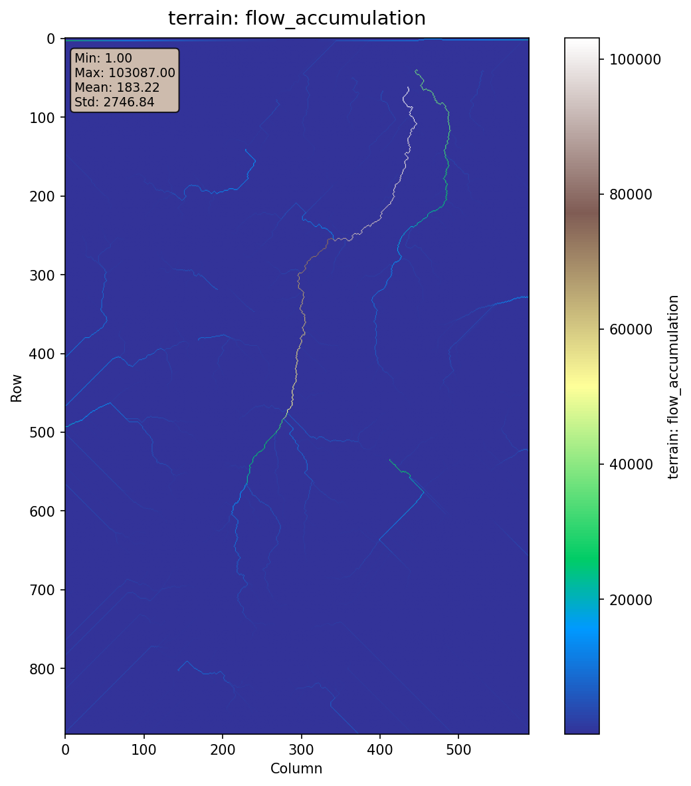
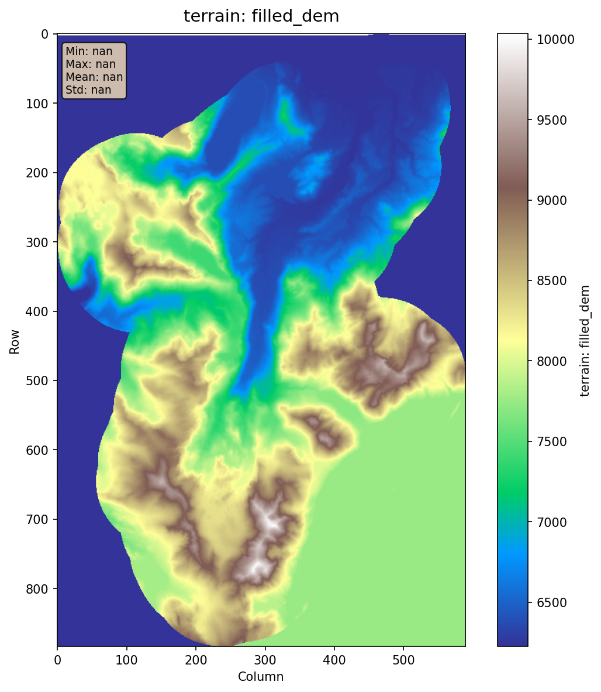
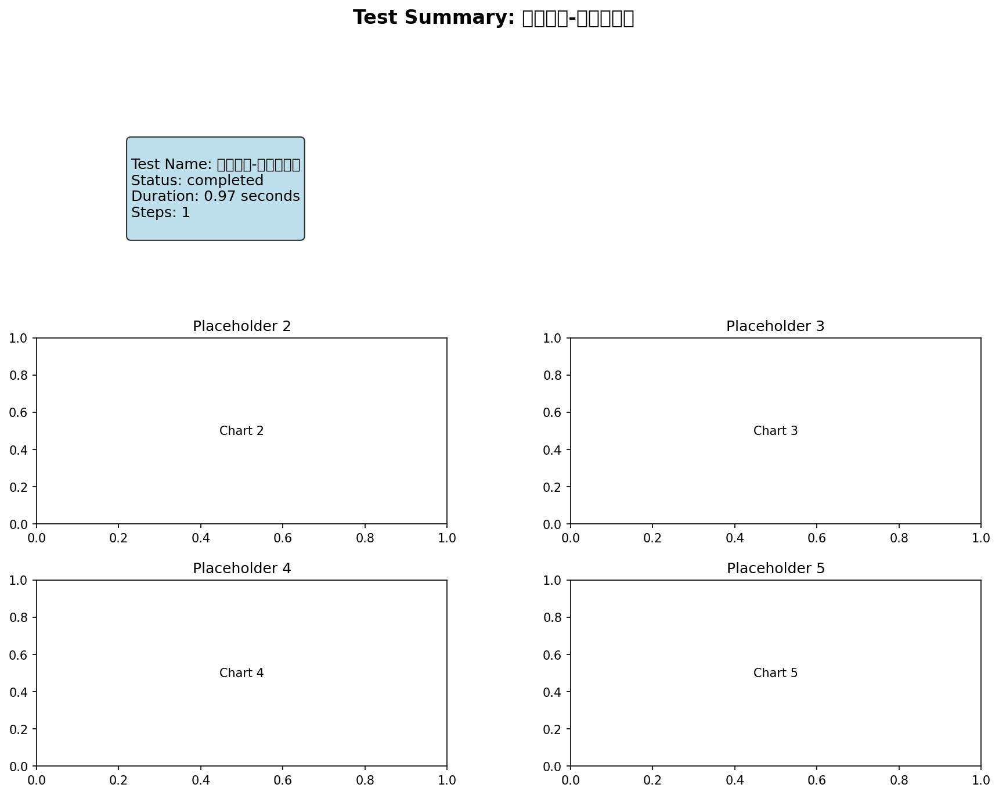

# 最小测试-仅地形 - 测试报告

## 测试概览

- **测试名称**: 最小测试-仅地形
- **执行时间**: 2025-10-26T09:54:57.906248
- **状态**: ✅ 通过
- **耗时**: 1.87秒

## 输入参数

```yaml
config_file: config/workflows/test_scenarios/01_minimal_terrain.yaml
scenario_id: '01'
scenario_name: 最小测试-仅地形
```

## 输出结果

| 输出项 | 路径 | 状态 |
|--------|------|------|
| flow_direction | `results/enhanced_workflow_tests/01_最小测试-仅地形/outputs/terrain/flow_direction.tif` | ✅ |
| flow_accumulation | `results/enhanced_workflow_tests/01_最小测试-仅地形/outputs/terrain/flow_accumulation.tif` | ✅ |

## 验证结果

### 📊 指标

- **total_duration**: 0.969178
- **step_count**: 1
- **completed_steps**: 1

## 可视化结果

### terrain_flow_direction


### terrain_flow_accumulation



### terrain_filled_dem



### terrain_slope


### summary



## 结论

✅ **测试通过** - 所有验证项都满足要求
