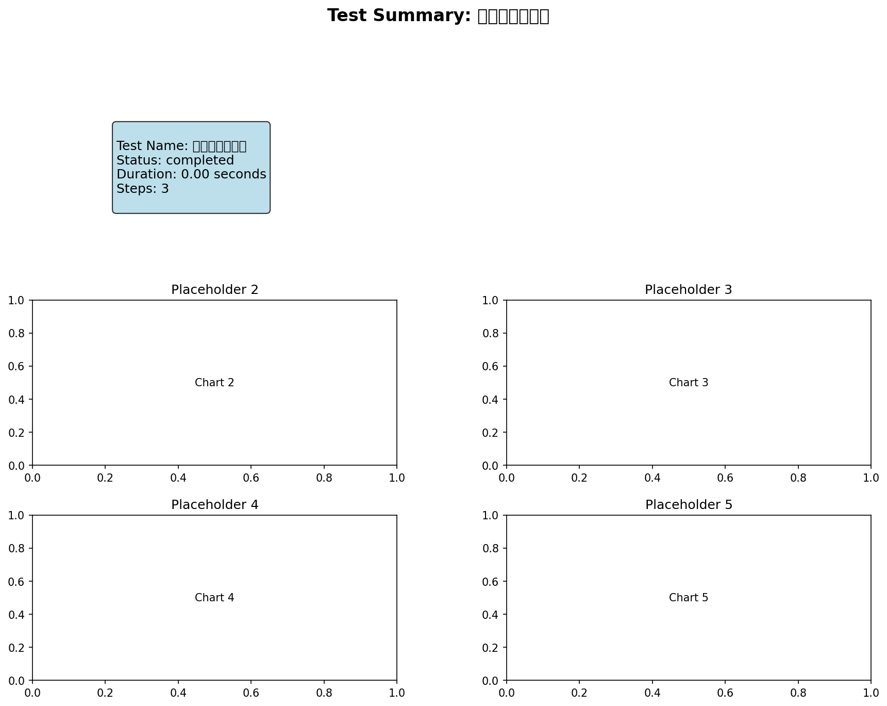

# 降雨分析 - 测试报告

## 测试概览

- **测试名称**: 降雨分析
- **执行时间**: 2025-10-26T07:37:21.725833
- **状态**: ✅ 通过
- **耗时**: 0.00秒

## 输入参数

```yaml
config_file: config/workflows/test_scenarios/04_precipitation_analysis.yaml
scenario_id: '04'
scenario_name: 降雨分析
```

## 输出结果

| 输出项 | 路径 | 状态 |
|--------|------|------|
| areal_precipitation | `results/workflow_tests/04_precipitation/areal_precip/areal_precip.csv` | ❌ |

## 验证结果

### ⚠️ 警告

- 输出文件缺失: rain_gauge.gauge_layout, rain_gauge.thiessen_polygons, precipitation.precipitation_timeseries, areal_precip.areal_precipitation

### 📊 指标

- **total_duration**: 0.001256
- **step_count**: 3
- **completed_steps**: 3

## 可视化结果

### summary



## 结论

✅ **测试通过** - 所有验证项都满足要求
