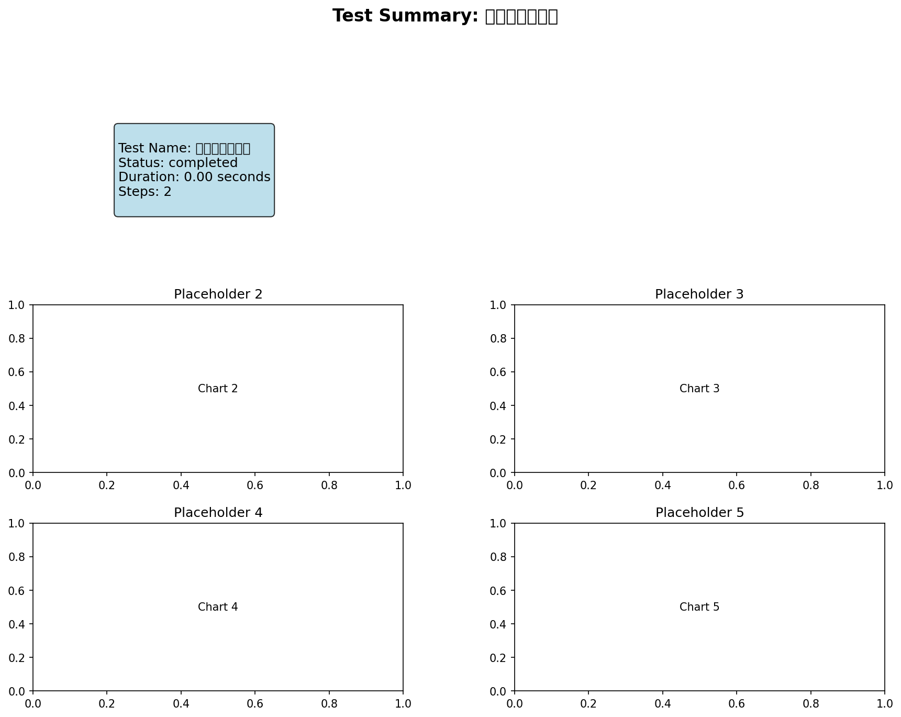

# 参数率定 - 测试报告

## 测试概览

- **测试名称**: 参数率定
- **执行时间**: 2025-10-26T08:11:03.598172
- **状态**: ✅ 通过
- **耗时**: 0.00秒

## 输入参数

```yaml
config_file: config/workflows/test_scenarios/06_calibration_workflow.yaml
scenario_id: '06'
scenario_name: 参数率定
```

## 输出结果

| 输出项 | 路径 | 状态 |
|--------|------|------|
| metrics | `{}` | ❌ |
| calibrated_parameters | `{}` | ❌ |

## 验证结果

### ⚠️ 警告

- 输出文件缺失: evaluation.report

### 📊 指标

- **total_duration**: 0.000696
- **step_count**: 2
- **completed_steps**: 2

## 可视化结果

### summary



## 结论

✅ **测试通过** - 所有验证项都满足要求
