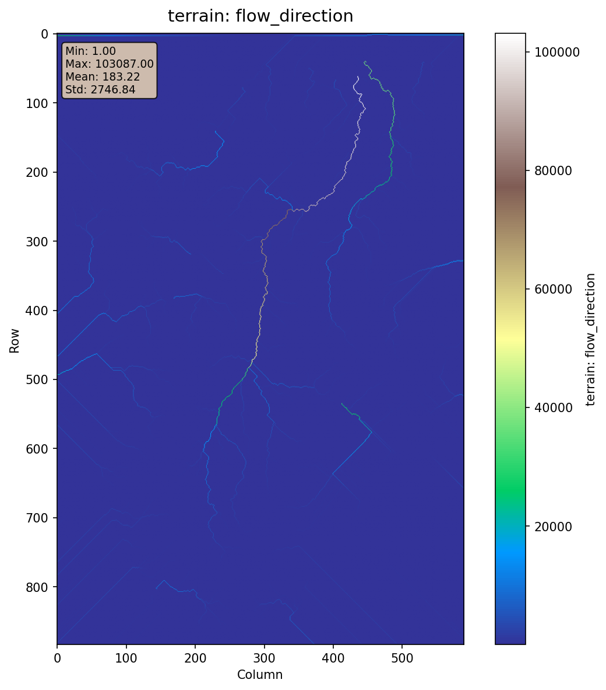
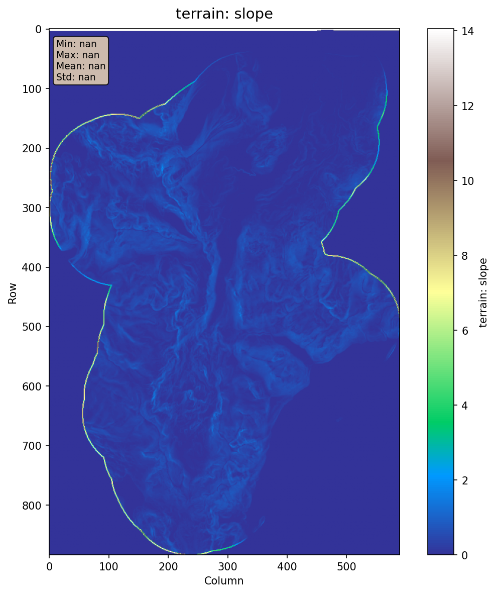
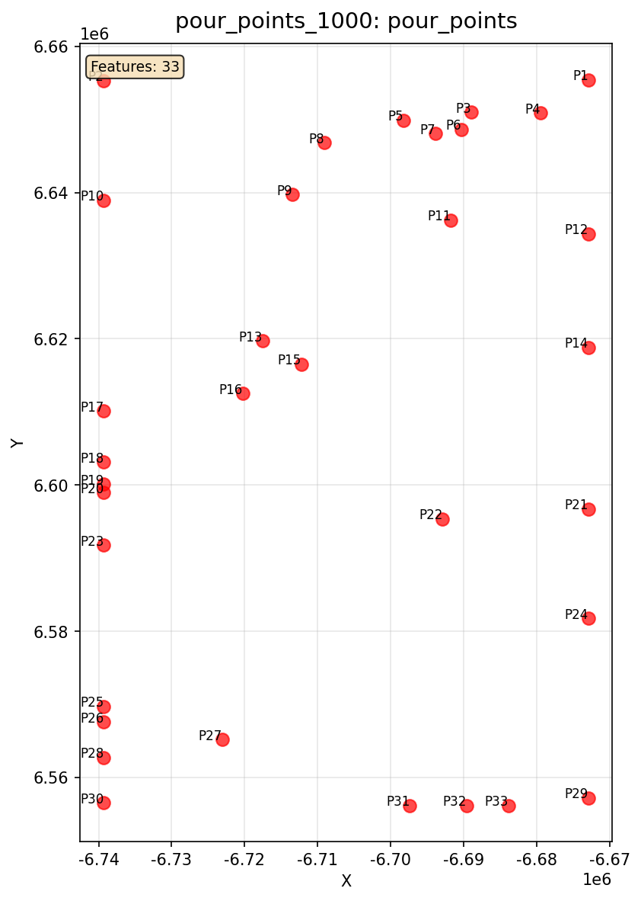
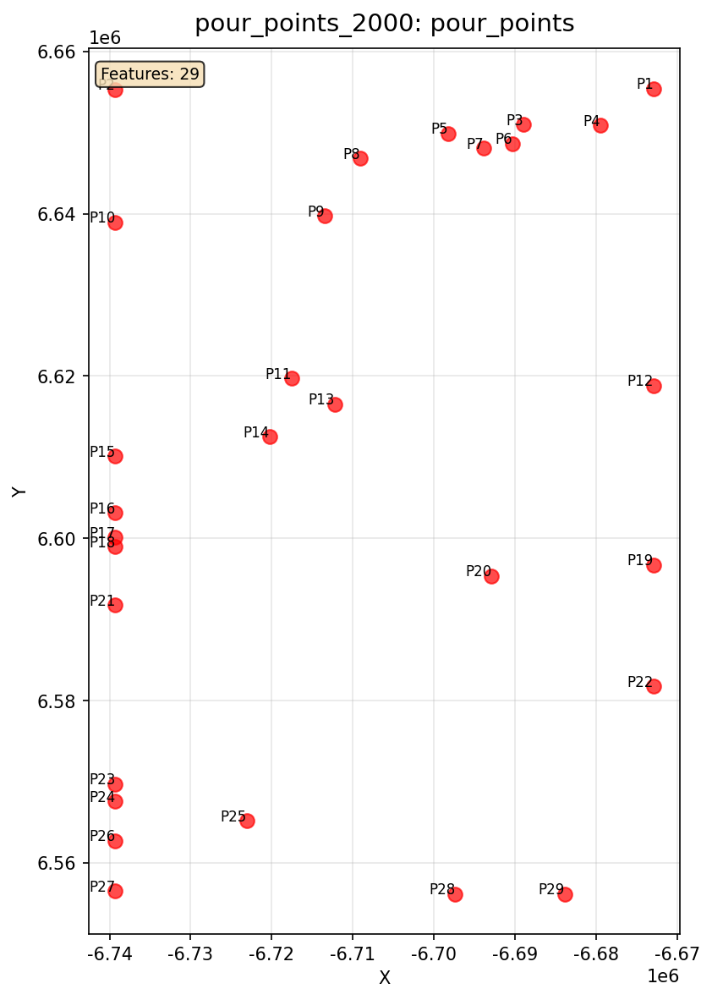
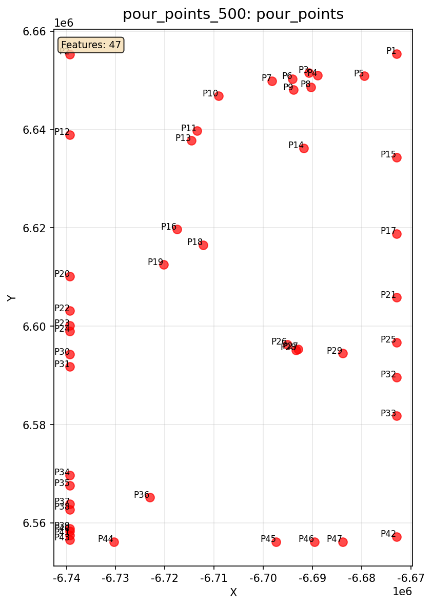
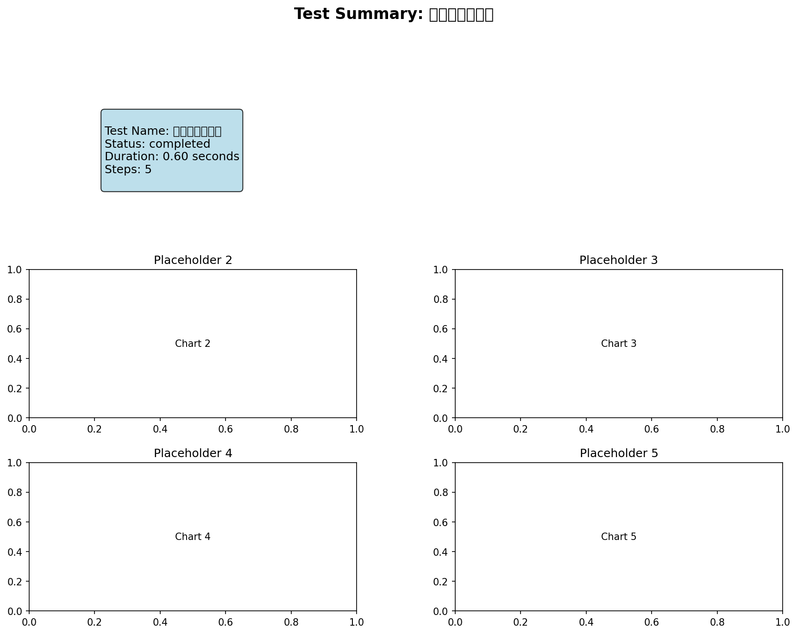

# 并行分析 - 测试报告

## 测试概览

- **测试名称**: 并行分析
- **执行时间**: 2025-10-26T09:55:12.635851
- **状态**: ✅ 通过
- **耗时**: 0.61秒

## 输入参数

```yaml
config_file: config/workflows/test_scenarios/07_parallel_analysis.yaml
scenario_id: '07'
scenario_name: 并行分析
```

## 输出结果

| 输出项 | 路径 | 状态 |
|--------|------|------|
| pour_points_1000 | `results/workflow_tests/07_parallel/pour_points_1000/pour_points.geojson` | ✅ |
| pour_points_2000 | `results/workflow_tests/07_parallel/pour_points_2000/pour_points.geojson` | ✅ |
| pour_points_500 | `results/workflow_tests/07_parallel/pour_points_500/pour_points.geojson` | ✅ |
| channel_network | `results/workflow_tests/07_parallel/channels/channels.geojson` | ❌ |

## 验证结果

### ⚠️ 警告

- 输出文件缺失: channel_network.channel_network

### 📊 指标

- **total_duration**: 0.602359
- **step_count**: 5
- **completed_steps**: 5

## 可视化结果

### terrain_flow_direction



### terrain_flow_accumulation


### terrain_filled_dem


### terrain_slope



### pour_points_1000_pour_points



### pour_points_2000_pour_points



### pour_points_500_pour_points



### summary



## 结论

✅ **测试通过** - 所有验证项都满足要求
