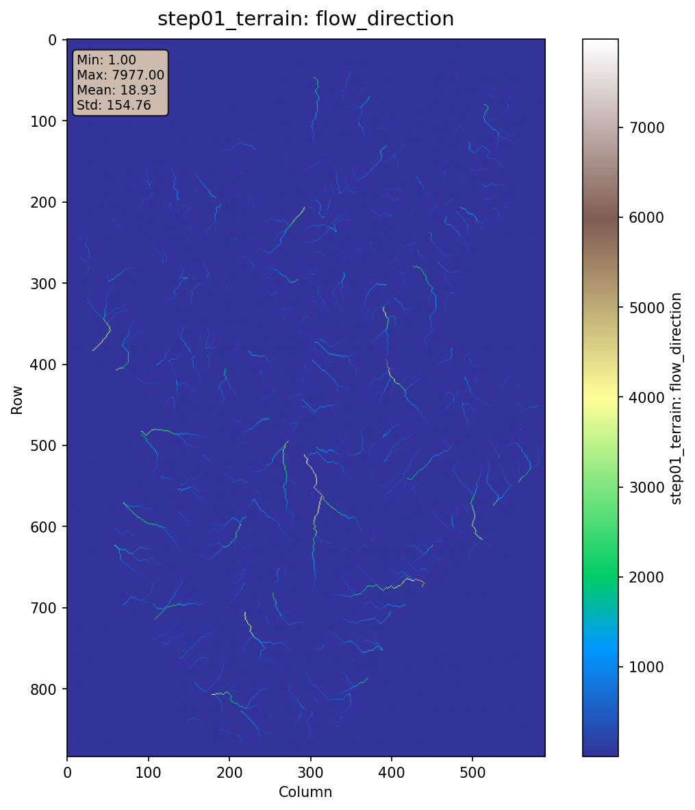
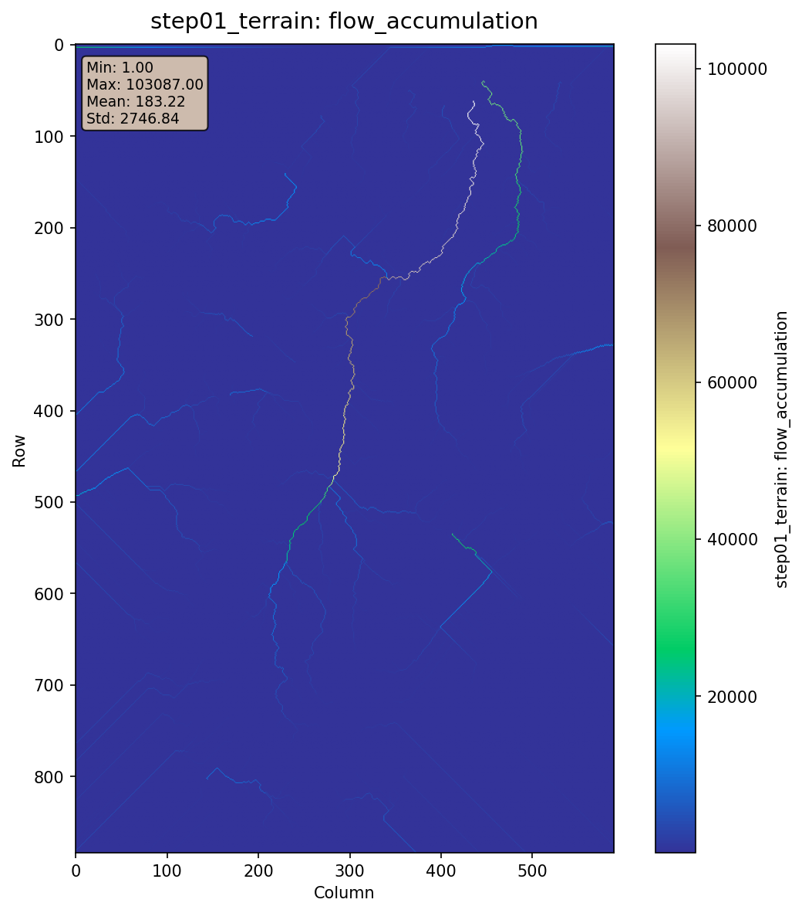
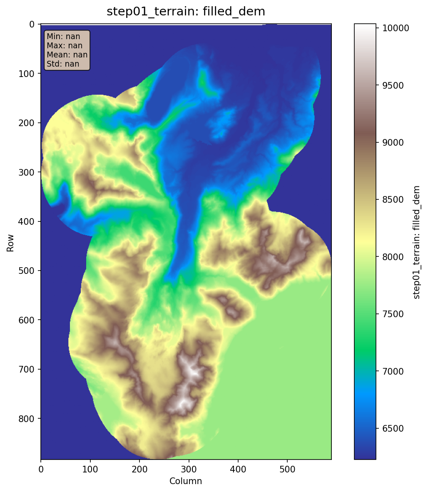
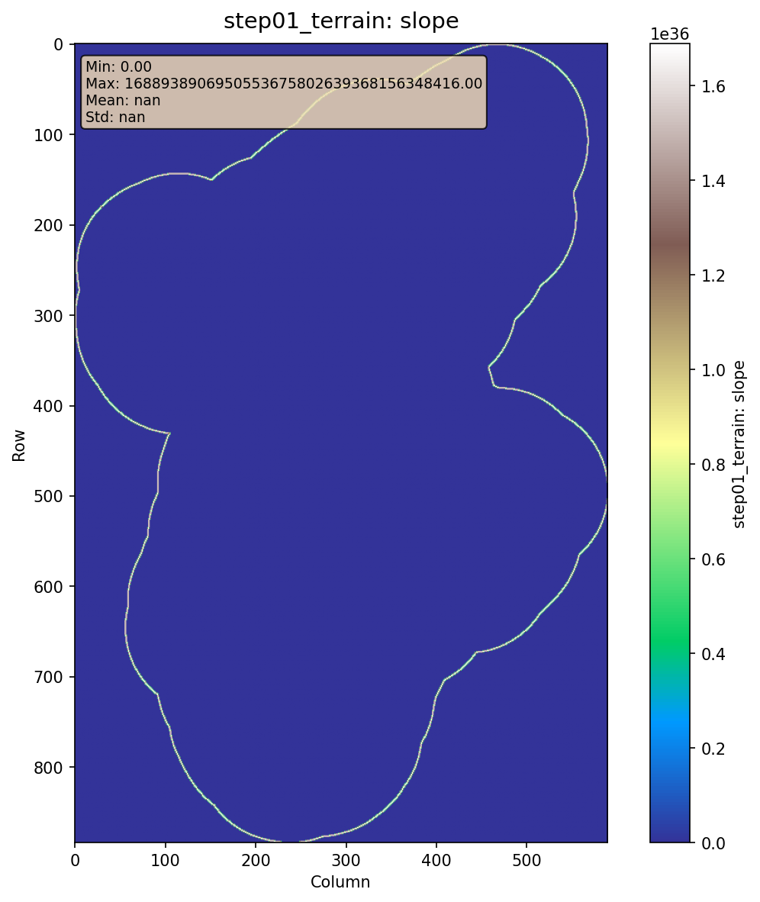
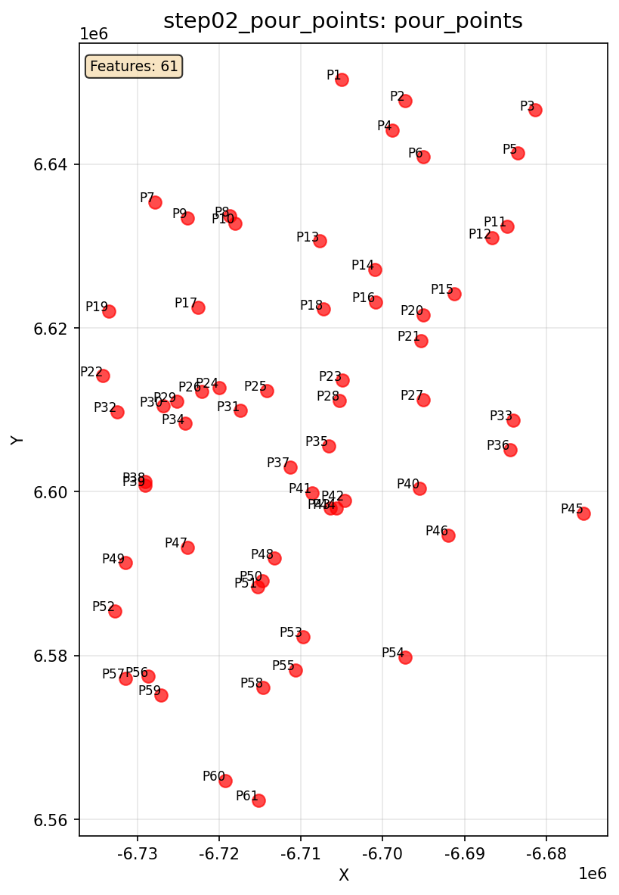
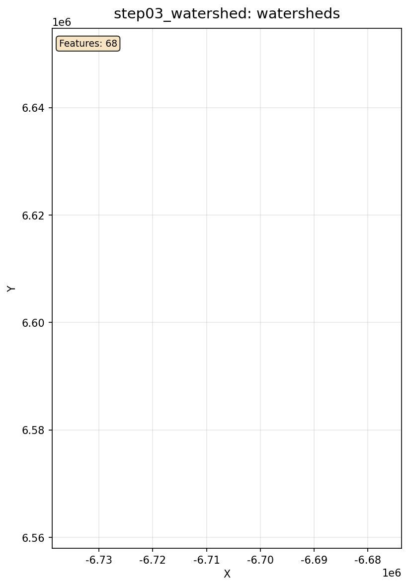
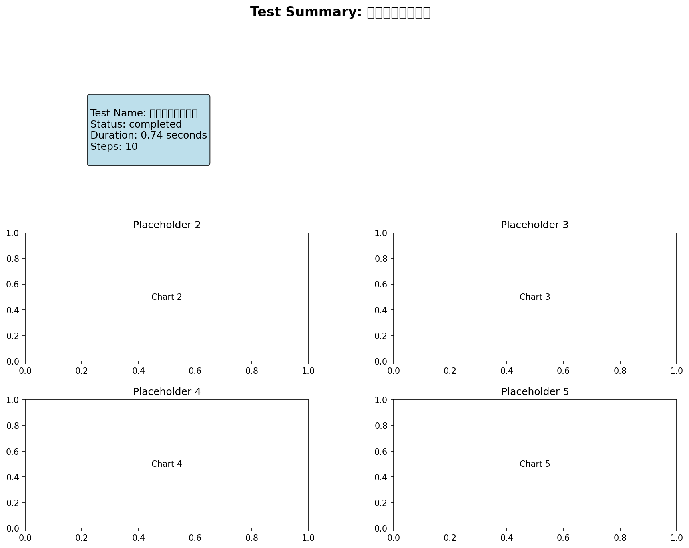

# 完整十一步 - 测试报告

## 测试概览

- **测试名称**: 完整十一步
- **执行时间**: 2025-10-26T08:28:10.788548
- **状态**: ✅ 通过
- **耗时**: 0.75秒

## 输入参数

```yaml
config_file: config/workflows/test_scenarios/08_complete_eleven_steps.yaml
scenario_id: 08
scenario_name: 完整十一步
```

## 输出结果

| 输出项 | 路径 | 状态 |
|--------|------|------|
| discharge | `results/workflow_tests/08_complete/10_routing/discharge.csv` | ❌ |
| evaluation_metrics | `{}` | ❌ |
| evaluation_report | `results/workflow_tests/08_complete/11_evaluation/report.md` | ❌ |

## 验证结果

### ⚠️ 警告

- 输出文件缺失: step04_channel.channel_network, step05_rain_gauge.gauge_layout, step05_rain_gauge.thiessen_polygons, step06_precipitation.precipitation_timeseries, step08_areal_precip.areal_precipitation, step09_runoff.runoff_timeseries, step10_routing.discharge_timeseries, step11_evaluation.report

### 📊 指标

- **total_duration**: 0.736085
- **step_count**: 10
- **completed_steps**: 10

## 可视化结果

### step01_terrain_flow_direction



### step01_terrain_flow_accumulation



### step01_terrain_filled_dem



### step01_terrain_slope



### step02_pour_points_pour_points



### step03_watershed_watersheds



### summary



## 结论

✅ **测试通过** - 所有验证项都满足要求
