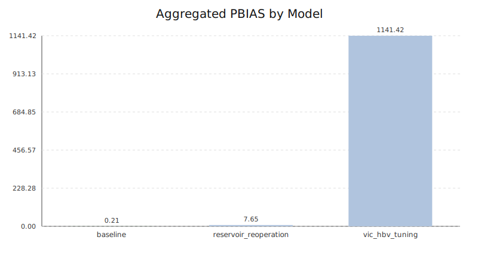
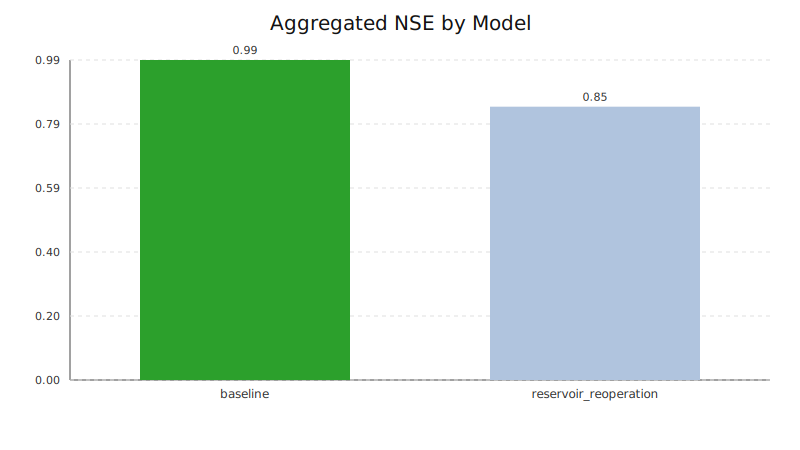
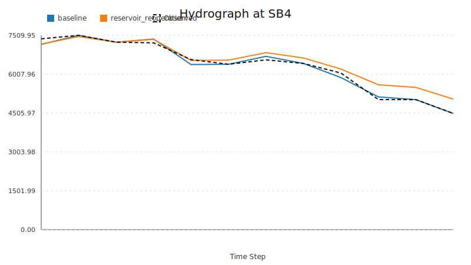
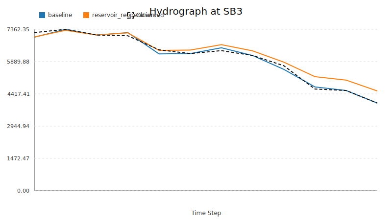
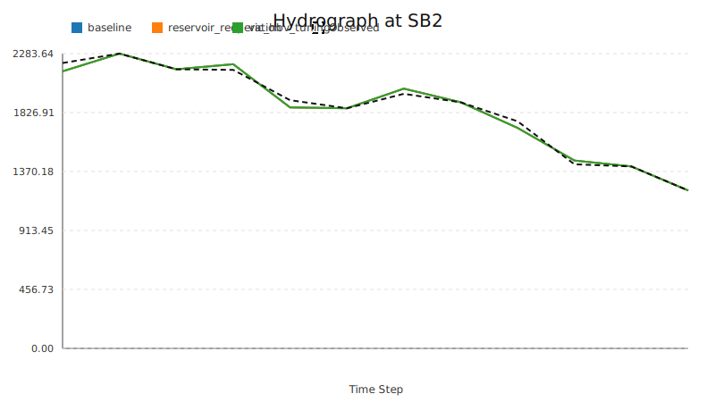
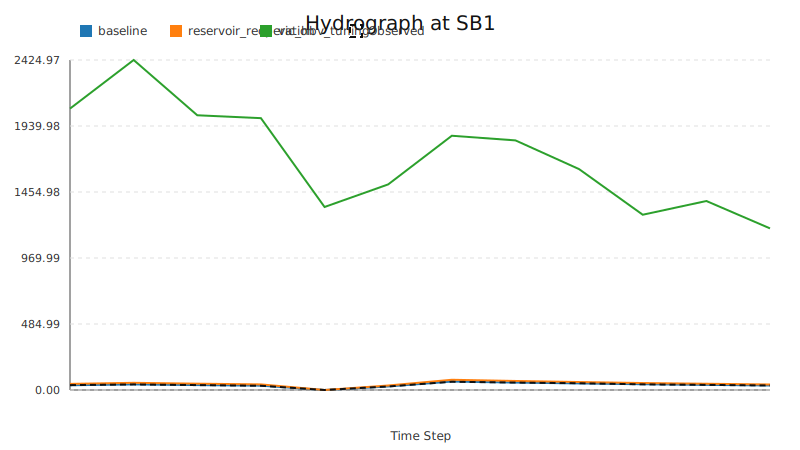

# HydroSIS 模型评估报告

自动生成的模型精度评价报告

## 总体评价指标

| Model | RMSE | MAE | PBIAS | NSE |
| --- | --- | --- | --- | --- |
| baseline | 66.3190 | 45.6124 | 0.2103 | 0.9903 |
| reservoir_reoperation | 161.3882 | 125.3837 | 7.6517 | 0.8458 |
| vic_hbv_tuning | 1587.4880 | 1559.4284 | 1141.4153 | -3384.3731 |

## 基于 RMSE 的模型排序

1. baseline: 66.31896097718354
2. reservoir_reoperation: 161.3881941190155
3. vic_hbv_tuning: 1587.4879887180691

## 指标图表

## 子流域径流过程对比

## 模型运行概述

本次评估比较了 3 套模拟方案（baseline, reservoir_reoperation, vic_hbv_tuning），评价指标包括 RMSE, MAE, PBIAS, NSE。

## 关键发现

在 Compare baseline and reservoir scenario at key gauges 中，排序为 baseline > reservoir_reoperation。

## 后续建议

可继续针对关键指标开展参数分区校准或扩展新的情景对比。
