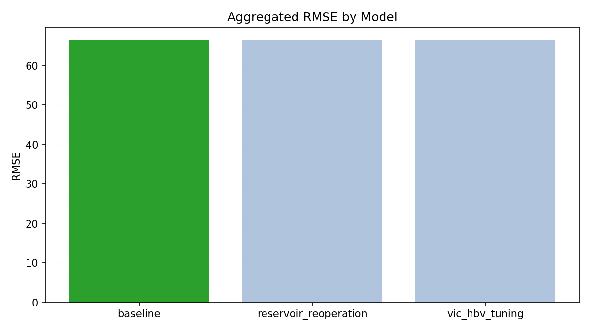
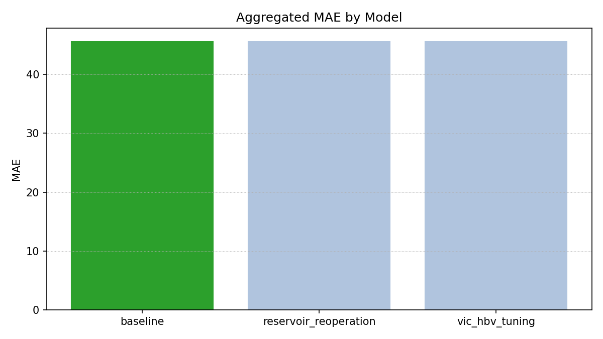
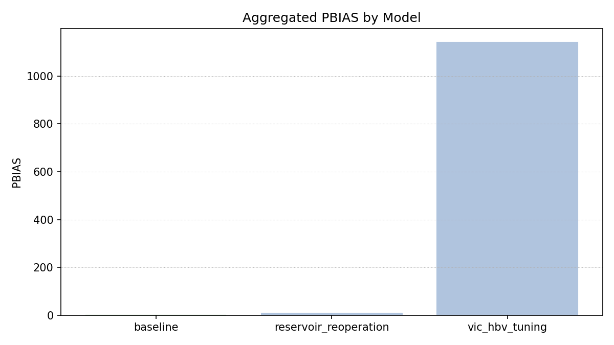
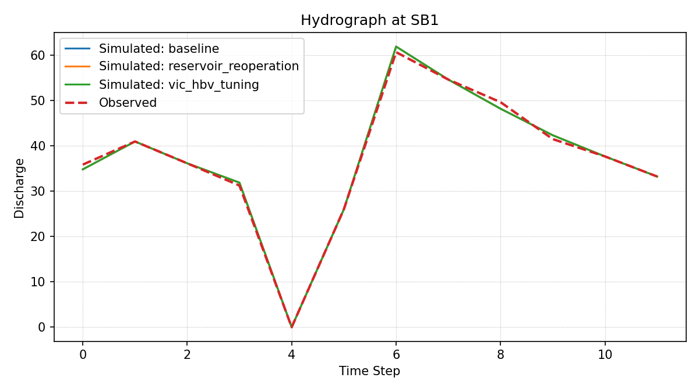
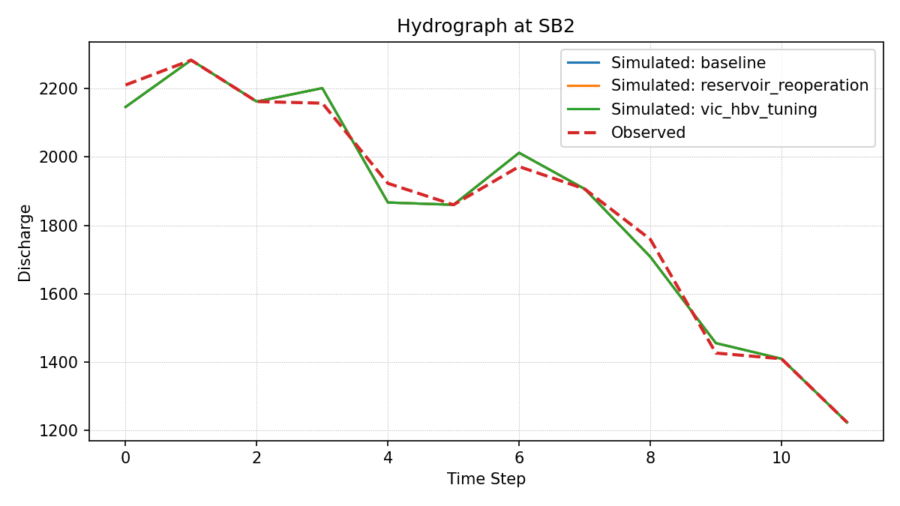
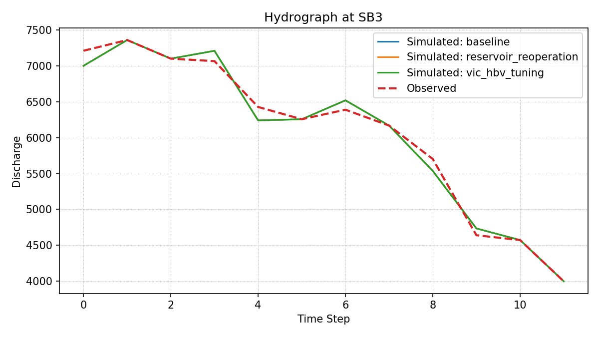

# HydroSIS Model Evaluation Report

Automatically generated evaluation report.

## Overall Evaluation Metrics

| Model | RMSE | MAE | PBIAS | NSE |
| --- | --- | --- | --- | --- |
| baseline | 66.3190 | 45.6124 | 0.2103 | 0.9903 |
| reservoir_reoperation | 66.3190 | 45.6124 | 0.2103 | 0.9903 |
| vic_hbv_tuning | 66.3190 | 45.6124 | 0.2103 | 0.9903 |

## Model Ranking Based on RMSE

1. baseline: 66.31896097718355
2. reservoir_reoperation: 66.31896097718355
3. vic_hbv_tuning: 66.31896097718355

## Metric Charts

## Subbasin Hydrograph Comparison

## Model Run Overview

（示例 LLM 输出）Based on the overall evaluation metrics, summarize the main performance of baseline and comparison scenarios, and explain the data sources.

## Key Findings

Plan Compare baseline and reservoir scenario at key gauges ranks baseline > reservoir_reoperation best to worst.

## Recommendations

（示例 LLM 输出）Based on current evaluation results, propose recommendations for further calibration, data collection, or scenario analysis.
