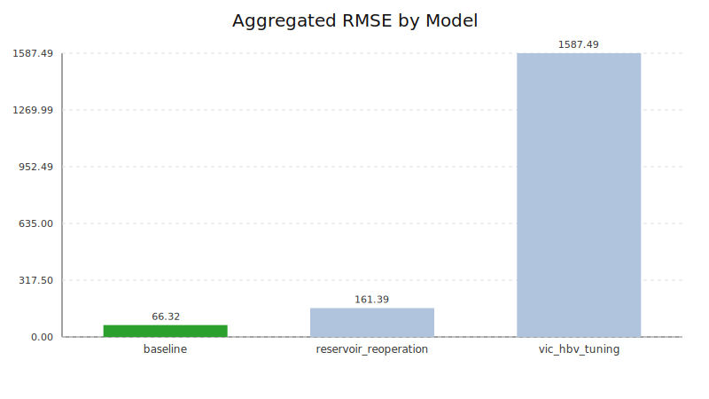
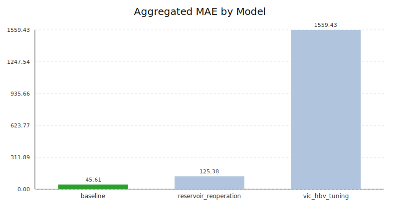
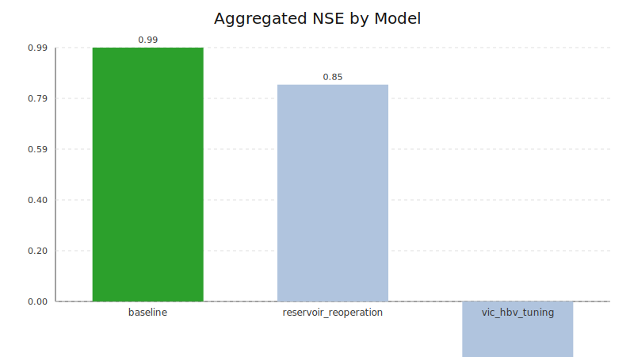
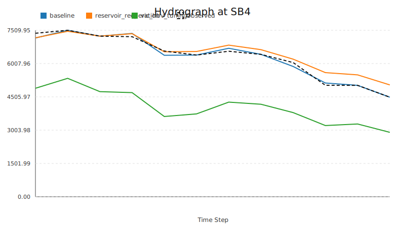
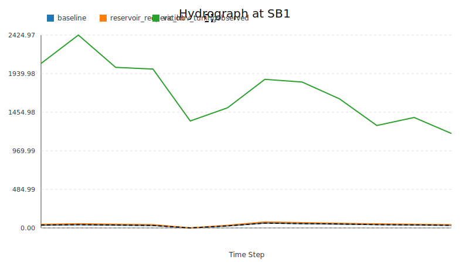
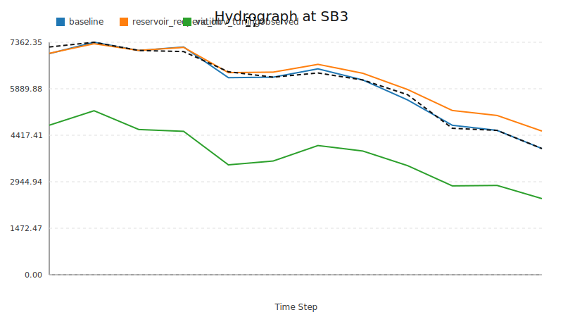

# HydroSIS 模型评估报告

自动生成的模型精度评价报告

## 总体评价指标

| Model | RMSE | MAE | PBIAS | NSE |
| --- | --- | --- | --- | --- |
| baseline | 66.3190 | 45.6124 | 0.2103 | 0.9903 |
| reservoir_reoperation | 161.3882 | 125.3837 | 7.6517 | 0.8458 |

## 基于 RMSE 的模型排序

1. baseline: 66.31896097718354
2. reservoir_reoperation: 161.3881941190155

## 指标图表

## 子流域径流过程对比

