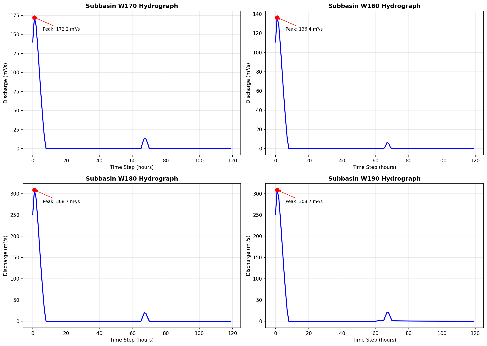

# Upper Truckee River 水文模拟结果

## 流域概况

| 子流域 | 面积 (km²) | 下游 | 产流模型 | 汇流模型 |
|--------|-----------|------|----------|----------|
| W170 | 45.2 | W180 | mountain_zone | muskingum_upper |
| W160 | 35.8 | W180 | mountain_zone | muskingum_upper |
| W180 | 125.5 | W190 | forest_zone | muskingum_main |
| W190 | 165.0 | 出口 | valley_zone | muskingum_outlet |

**总流域面积**: 371.5 km²

## 降雨设计

- **暴雨历时**: 24 小时
- **总降雨量**: 75.0 mm
- **峰值降雨强度**: 7.50 mm/h
- **暴雨类型**: 设计暴雨 (类似SCS Type II)

## 模拟结果

### 峰值流量

| 子流域 | 峰值流量 (m³/s) | 峰现时间 (h) |
|--------|----------------|-------------|
| W170 | 172.24 | 1 |
| W160 | 136.42 | 1 |
| W180 | 308.67 | 1 |
| W190 | 308.67 | 1 |

### 流量过程

## 模型配置

### 产流模型

- **mountain_zone**: HBV模型（雪融径流）
- **forest_zone**: SCS-CN模型（CN=65）
- **valley_zone**: SCS-CN模型（CN=72）

### 汇流模型

- **muskingum_upper**: K=8h, x=0.25
- **muskingum_main**: K=12h, x=0.20
- **muskingum_outlet**: K=15h, x=0.15

---

*Generated by HydroSIS - Upper Truckee River Workflow*
